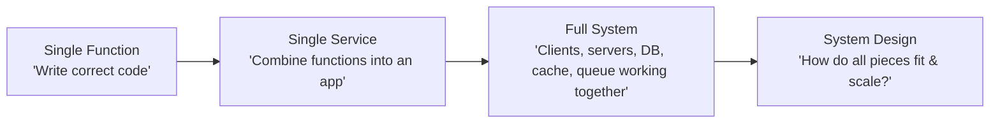
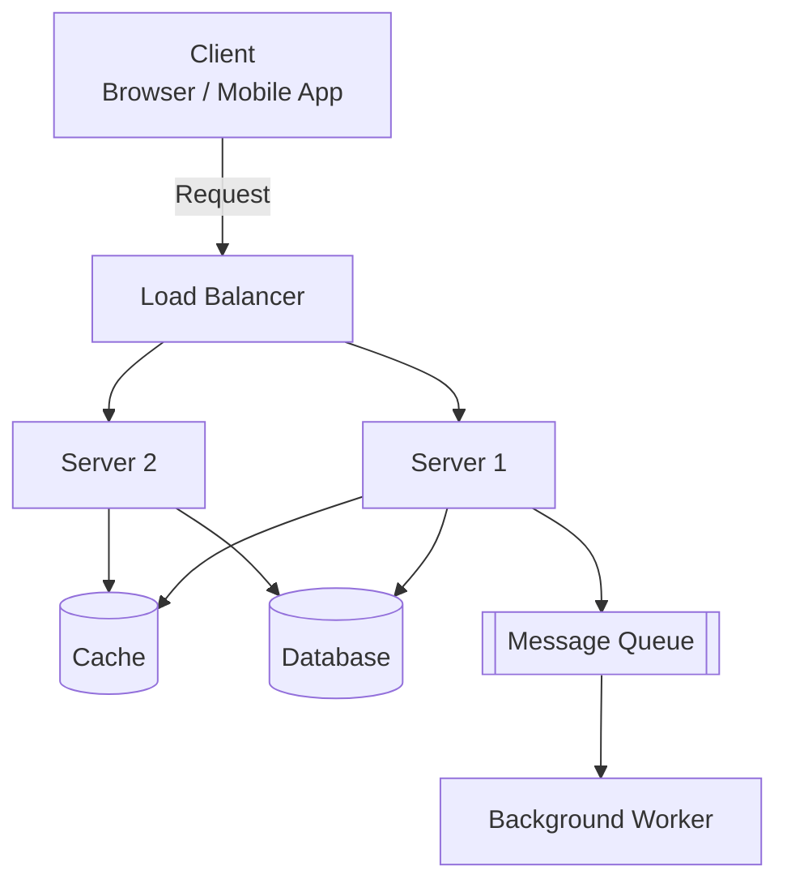

# Diagrams: System Design কী?

## ১. Code থেকে Architecture পর্যন্ত

*Caption: System design individual code থেকে জুম আউট করে পুরো systems-এর components কীভাবে একসাথে খাপ খায় তার দিকে তাকায়।*

## ২. একটি সাধারণ System-এর Core Building Blocks

*Caption: বারবার ফিরে আসা চরিত্রগুলো — client, load balancer, servers, cache, database, এবং message queue — যা এই পুরো course টুকরো টুকরো করে ব্যাখ্যা করবে।*

## ৩. Course Roadmap Flow

```mermaid
flowchart LR
    M1[Module 1\nFoundations] --> M2[Module 2\nNetworking]
    M2 --> M3[Module 3\nDatabases]
    M3 --> M4[Module 4\nCaching & CDN]
    M4 --> M5[Module 5\nMessaging]
    M5 --> M6[Module 6\nDistributed Systems]
    M6 --> M7[Module 7\nArchitecture Patterns]
    M7 --> M8[Module 8\nProtocols, Formats & Security]
    M8 --> M9[Module 9\nDatabase & API Internals]
    M9 --> M10[Module 10\nDistributed Coordination & Scale]
    M10 --> M11[Module 11\nObservability & Production Ops]
    M11 --> M12[Module 12\nCase Studies]
```

*Caption: প্রতিটি module সরাসরি আগের module-এ introduce করা vocabulary এবং concepts-এর উপর ভিত্তি করে গড়ে ওঠে।*
