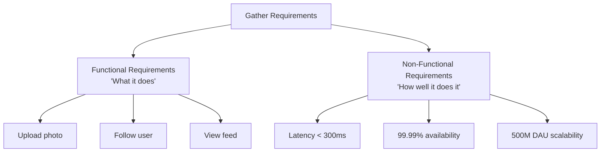
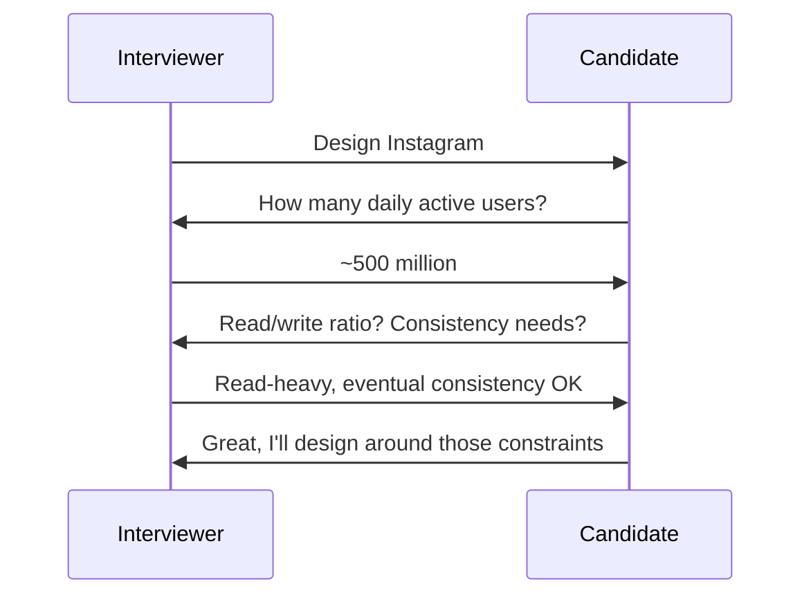
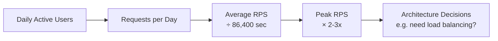

# Diagrams: Functional vs Non-Functional Requirements

## ১. Requirements-এর বিভাজন

*Caption: প্রতিটি design শুরু হয় requirements-কে দুই ভাগে বিভক্ত করে — system কী করে বনাম এটা কতটা ভালোভাবে করতে হয়।*

## ২. একটি Interview-এ Requirements Gathering-এর Flow

*Caption: কোনো architecture প্রস্তাব করার আগে, clarifying questions একটি অস্পষ্ট প্রম্পটকে concrete, design-চালিত requirements-এ রূপান্তরিত করে।*

## ৩. Back-of-the-Envelope Estimation Pipeline

*Caption: গুণ ও ভাগের একটি সাধারণ শৃঙ্খল "অনেক users"-কে এমন concrete সংখ্যায় রূপান্তরিত করে যা প্রকৃত design সিদ্ধান্তকে চালিত করে।*
</content>
