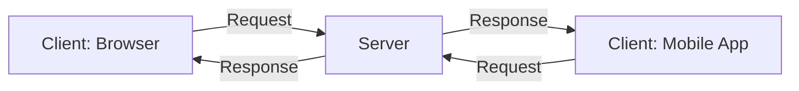
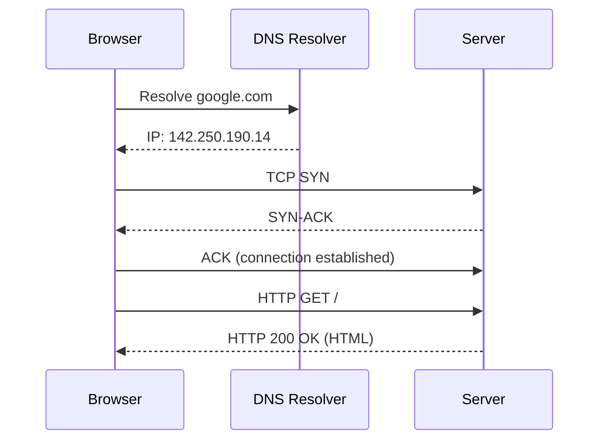
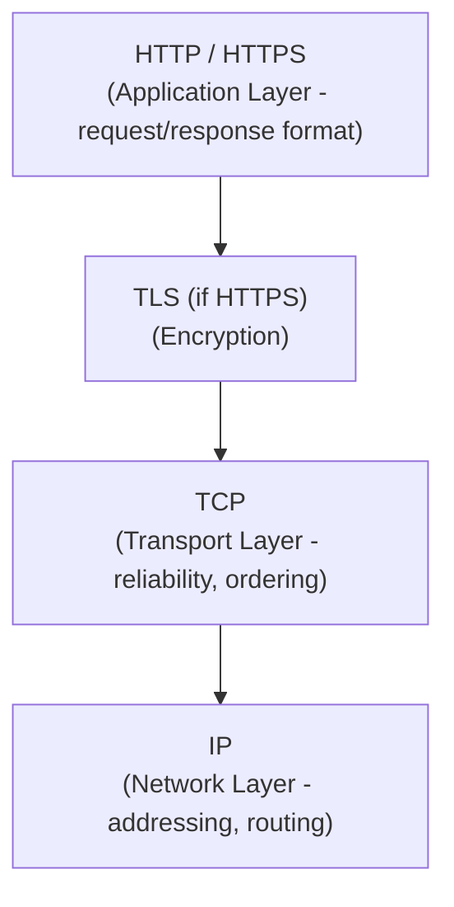

# ডায়াগ্রাম: Client-Server Architecture & How the Internet Works

## ১. Client-Server Model

*Caption: একাধিক client একটি server-এ request পাঠায়, যেটি সেগুলো process করে এবং response ফেরত পাঠায়।*

## ২. সম্পূর্ণ Request Sequence: URL থেকে Page

*Caption: URL টাইপ করা থেকে page পাওয়া পর্যন্ত সম্পূর্ণ যাত্রা: DNS lookup, TCP handshake, তারপর HTTP বিনিময়।*

## ৩. TCP/IP এবং HTTP-এর Layering

*Caption: HTTP চলে TCP/IP-এর ওপর দিয়ে — IP addressing এবং routing সামলায়, TCP reliability যোগ করে, এবং HTTP message-এর format নির্ধারণ করে।*
