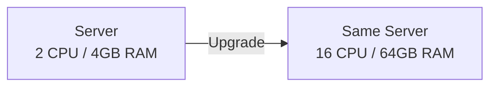
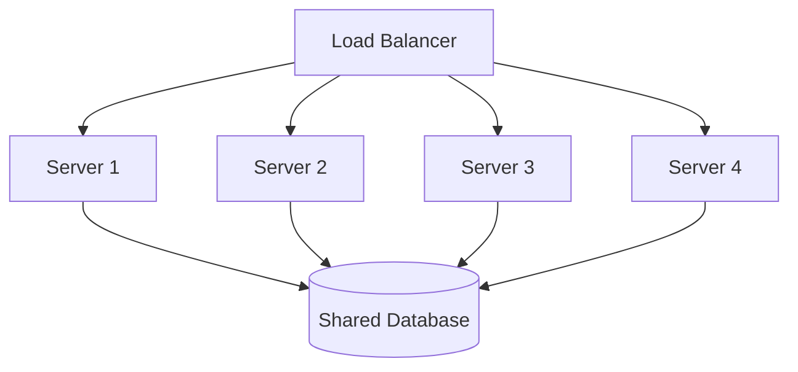
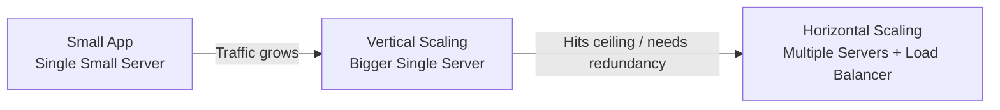

# Diagrams: Scalability Basics — Vertical vs Horizontal Scaling

## ১. Vertical Scaling

*Caption: Vertical scaling একটি machine-কে তার নিজের একটি আরও শক্তিশালী সংস্করণ দিয়ে প্রতিস্থাপন করে — একই single point of failure রয়ে যায়।*

## ২. Horizontal Scaling

*Caption: Horizontal scaling একটি load balancer-এর পেছনে আরও machine যোগ করে, সবগুলো একটি common data store শেয়ার করে।*

## ৩. Growth Path: Vertical First, Then Horizontal

*Caption: একটি সাধারণ scaling যাত্রা — সরলতার জন্য vertical scaling দিয়ে শুরু করুন, বৃদ্ধির চাহিদা অনুযায়ী horizontal scaling-এ স্থানান্তরিত হন।*
