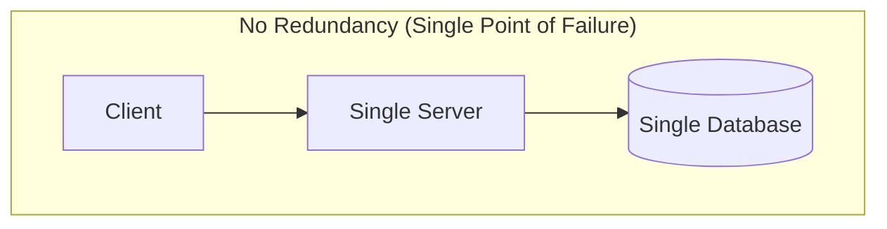
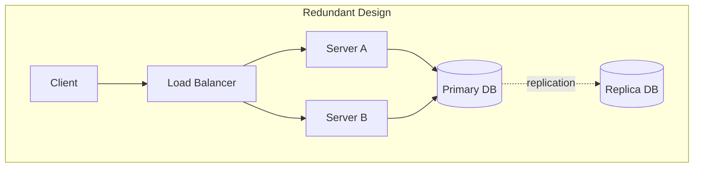
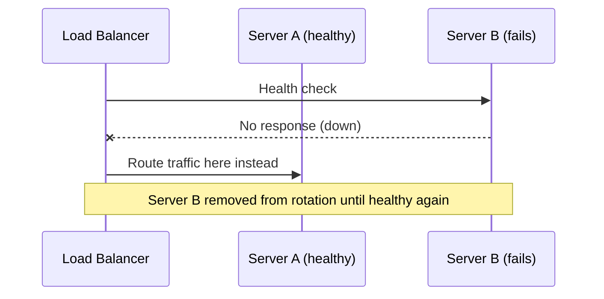
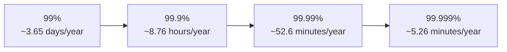

# ডায়াগ্রাম: Availability, Reliability, Redundancy & Fault Tolerance

## ১. Single Point of Failure বনাম Redundant ডিজাইন

*Caption: একটি একক server এবং একক database মানে যেকোনো একটি ব্যর্থতা পুরো সিস্টেমকে ধ্বসিয়ে দেয়।*

*Caption: Redundant server এবং একটি replicated database মানে কোনো একক ব্যর্থতা সিস্টেমকে ধ্বসিয়ে দেয় না।*

## ২. Health Check-এর মাধ্যমে Failover ক্রম

*Caption: Health check একটি load balancer-কে একটি ব্যর্থ server শনাক্ত করতে এবং স্বয়ংক্রিয়ভাবে একটি সুস্থ server-এ ট্র্যাফিক failover করতে দেয়।*

## ৩. The Nines: Downtime তুলনা

*Caption: Availability-র প্রতিটি অতিরিক্ত "nine" বার্ষিক অনুমোদিত downtime-এ প্রায় 10x হ্রাস নির্দেশ করে।*
</content>
