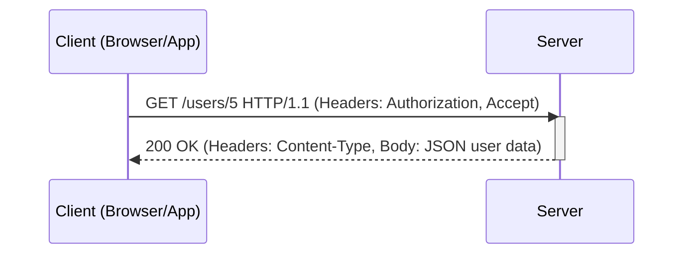
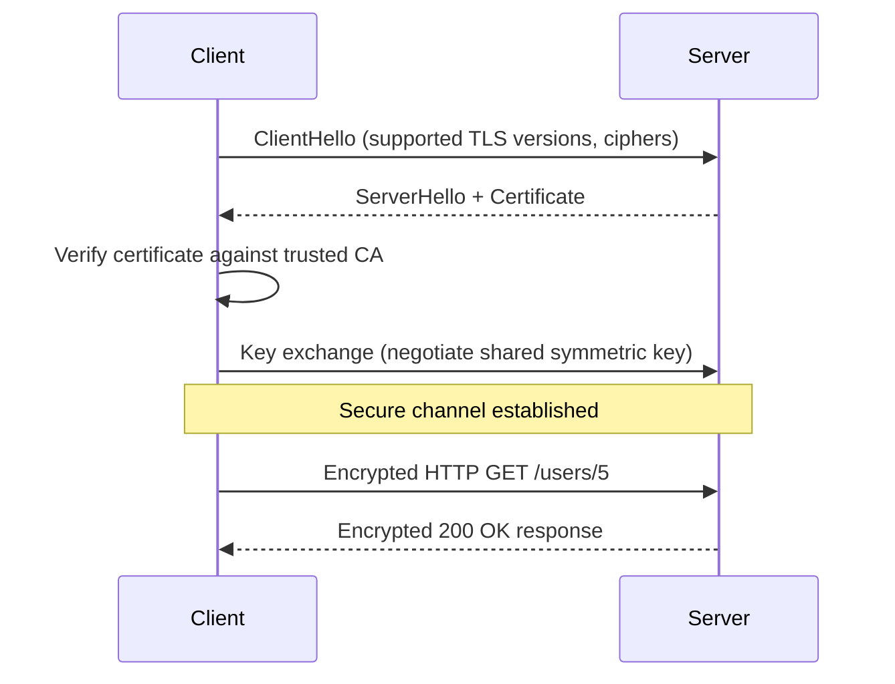
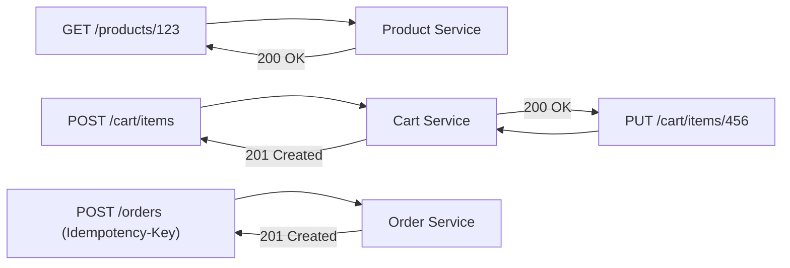

# Diagrams: HTTP/HTTPS & REST APIs

## 1. Basic HTTP Request-Response Cycle

*একটি client একটি stateless HTTP request পাঠায় এবং server একটি status code, headers, এবং একটি body দিয়ে উত্তর দেয় — আগের requests-এর কোনো memory রাখা হয় না।*

## 2. TLS Handshake Before an HTTPS Request

*HTTPS server-কে authenticate করতে এবং encryption keys নিয়ে সম্মত হতে একবার একটি TLS handshake সম্পন্ন করে, এরপর সেই session-এর সব HTTP traffic encrypted থাকে।*

## 3. REST Resource Model for an E-Commerce Checkout

*Checkout-এর প্রতিটি ধাপ একটি resource এবং একটি HTTP method-এর উপর map হয়; POST /orders একটি idempotency key বহন করে যাতে retries duplicate orders তৈরি না করে।*
