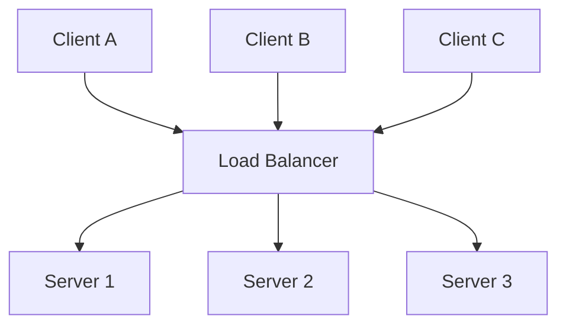
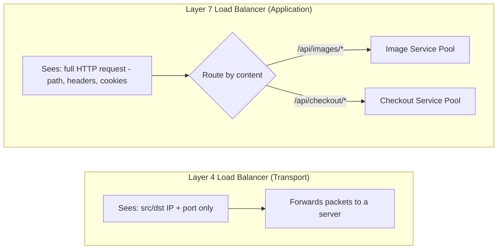
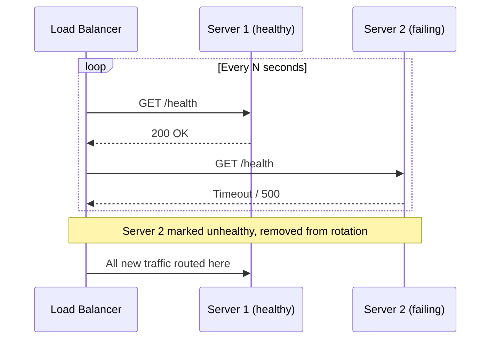

# Diagrams: Load Balancing

## ১. মৌলিক Load Balancer Topology

*Client-রা কখনোই শুধুমাত্র load balancer-কে address করে; এটাই সিদ্ধান্ত নেয় কোন backend server প্রতিটা request handle করবে, fleet-এর আকার এবং topology লুকিয়ে রাখে।*

## ২. Layer 4 vs Layer 7 সিদ্ধান্ত গ্রহণ

*L4 balancer শুধু IP/port-এর ভিত্তিতে packet সরায়; L7 balancer HTTP বোঝে এবং ভিন্ন path-কে সম্পূর্ণ ভিন্ন backend pool-এ route করতে পারে।*

## ৩. একটা ব্যর্থ Server অপসারণকারী Health Check Loop

*Load balancer ক্রমাগত backend health probe করে এবং নিঃশব্দে ব্যর্থ server গুলো থেকে traffic দূরে reroute করে।*
