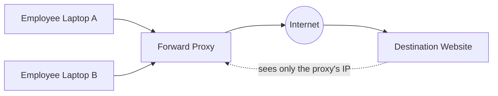
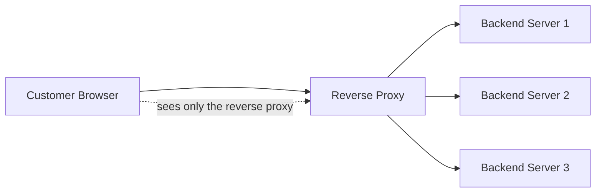
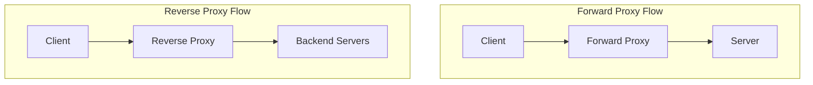

# Diagrams: Forward Proxy vs Reverse Proxy

## ১. Forward Proxy — Client-কে Protect করা

*Destination server শুধুমাত্র forward proxy-র identity দেখতে পায় — কোন নির্দিষ্ট client request করেছে তার কোনো visibility এটির নেই।*

## ২. Reverse Proxy — Server-কে Protect করা

*Client বিশ্বাস করে যে সে সরাসরি "the server"-এর সাথে কথা বলছে — এটি কখনো জানতে পারে না যে reverse proxy-র পেছনে backend server-এর একটি fleet বিদ্যমান।*

## ৩. Side-by-Side: একই Traffic Path, বিপরীত Purpose

*Structurally একই — client, proxy, server — কিন্তু forward proxy client-পক্ষ দ্বারা deploy করা হয় এবং তাদের represent করে, যেখানে reverse proxy server-পক্ষ দ্বারা deploy করা হয় এবং তাদের represent করে।*
