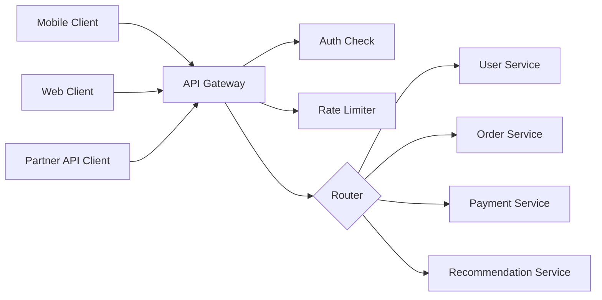
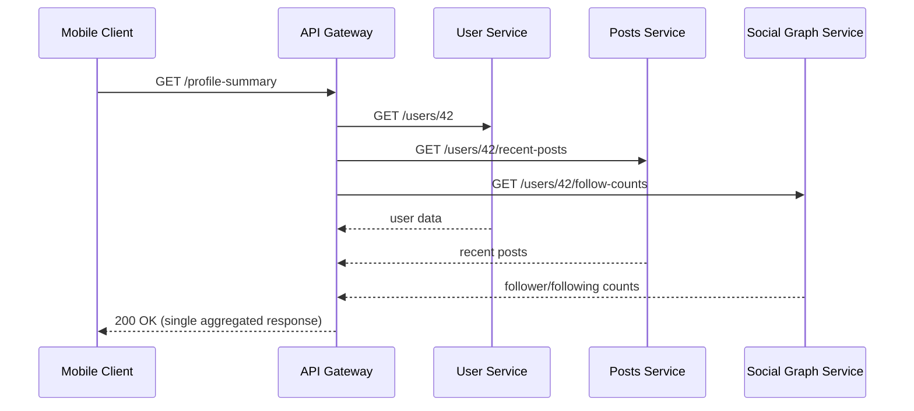
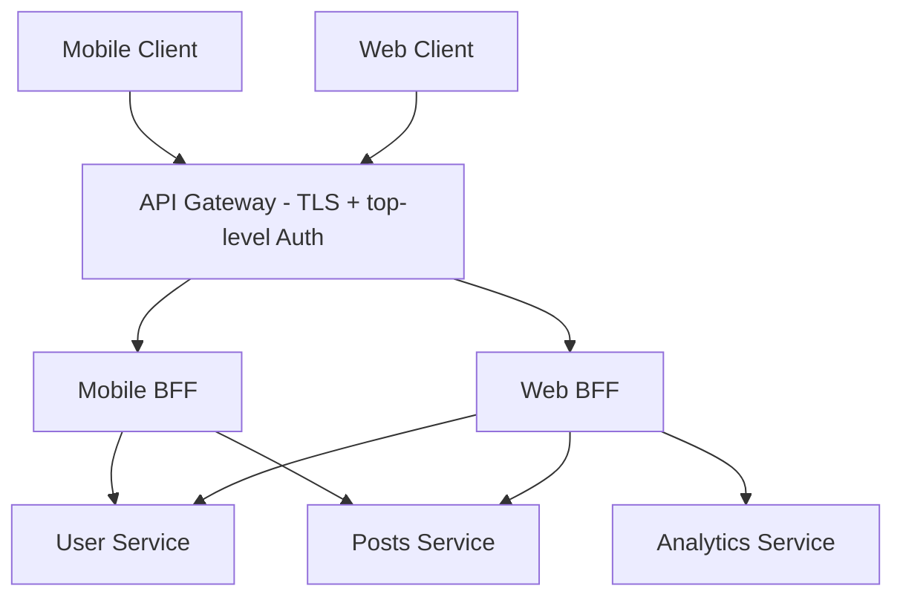

# Diagrams: API Gateway ও Backend-for-Frontend

## ১. একটি Microservices আর্কিটেকচারের সামনে API Gateway

*সঠিক backend microservice-এ request route করার আগে একটি একক gateway প্রতিটি client-এর জন্য authentication এবং rate limiting কেন্দ্রীভূত করে।*

## ২. Gateway-তে Request Aggregation

*Gateway একটি client request-কে তিনটি দ্রুত internal call-এ fan out করে, mobile client-কে তিনটি আলাদা ধীর round trip থেকে রক্ষা করে।*

## ৩. API Gateway + Backend-for-Frontend Layer

*Gateway প্রতিটি client-এর জন্য universal concern গুলো handle করে, তারপর একটি client-specific BFF-এ route করে যা সেই client-এর ঠিক প্রয়োজন অনুযায়ী data shape ও aggregate করে।*
