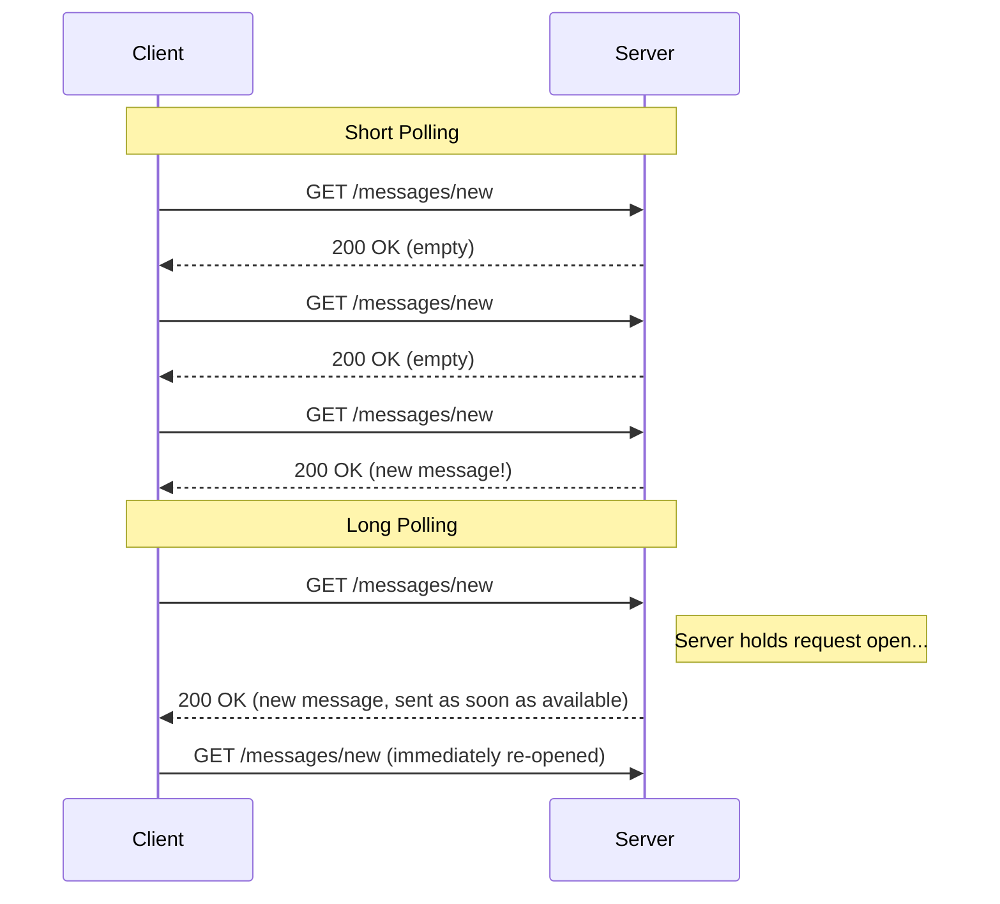
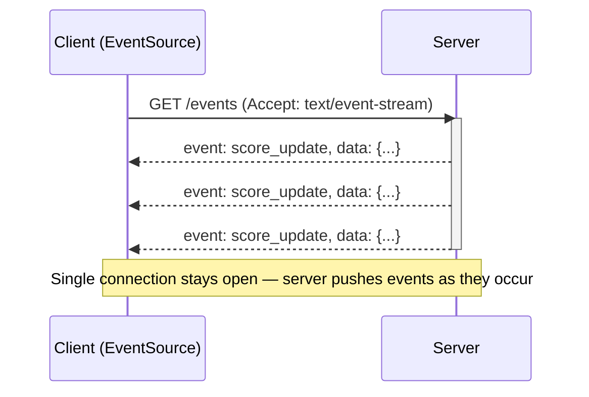
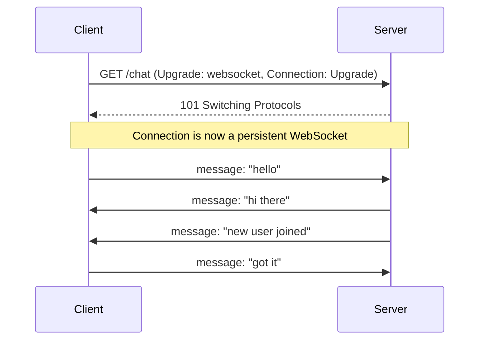

# Diagrams: WebSockets, Long Polling & Server-Sent Events

## ১. Short Polling বনাম Long Polling

*Short polling নতুন data আছে কিনা তা না দেখেই বারবার জিজ্ঞেস করে; long polling request খোলা রাখে এবং কিছু আসা মাত্রই জবাব দেয়।*

## ২. Server-Sent Events — একটা Persistent, এক-দিকমুখী Stream

*একটা HTTP connection অনির্দিষ্টকালের জন্য খোলা থাকে যতক্ষণ server client-এর কাছে event stream করে; client এই channel-এ কখনো ফেরত data পাঠায় না।*

## ৩. WebSocket Handshake এবং Full-Duplex Communication

*HTTP থেকে WebSocket-এ upgrade handshake হওয়ার পর, একই persistent connection-এর উপর দিয়ে যে-কোনো পক্ষ যে-কোনো সময় অপর পক্ষকে message পাঠাতে পারে।*
</content>
