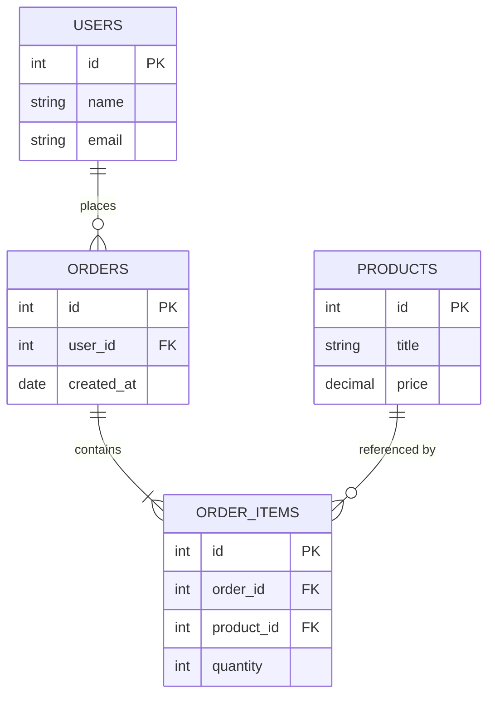
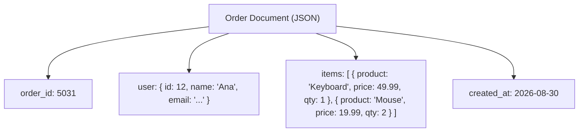
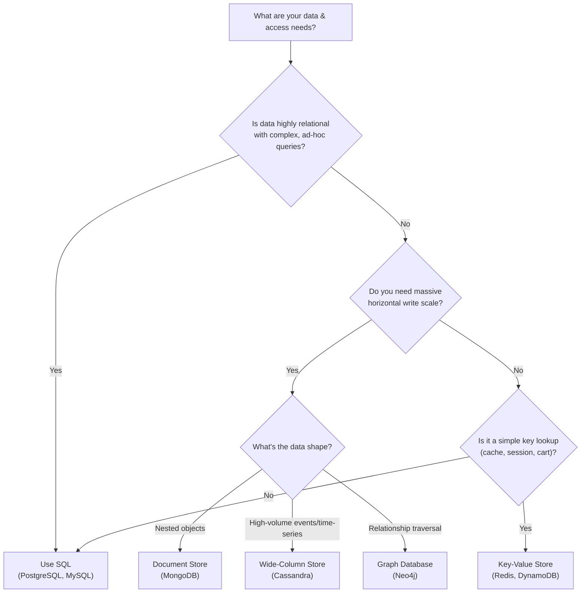

### Diagrams: SQL vs NoSQL

## ১. Relational Schema — Foreign Key সহ Normalized

*Caption: একটি relational (SQL) schema প্রতিটি fact একবার store করে এবং table-গুলোকে foreign key দিয়ে সংযুক্ত করে, যা query-র সময় join করা হয়।*

## ২. Denormalized Document Structure (NoSQL)

*Caption: একটি document store সম্পর্কিত data সরাসরি একটি record-এর ভেতরে embed করে, duplication-এর বিনিময়ে কোনো join ছাড়াই একটি single দ্রুত read পায়।*

## ৩. Decision Tree: SQL vs NoSQL

*Caption: data-র shape এবং scale requirement থেকে একটি concrete database category পর্যন্ত একটি বাস্তবসম্মত decision path।*
</content>
