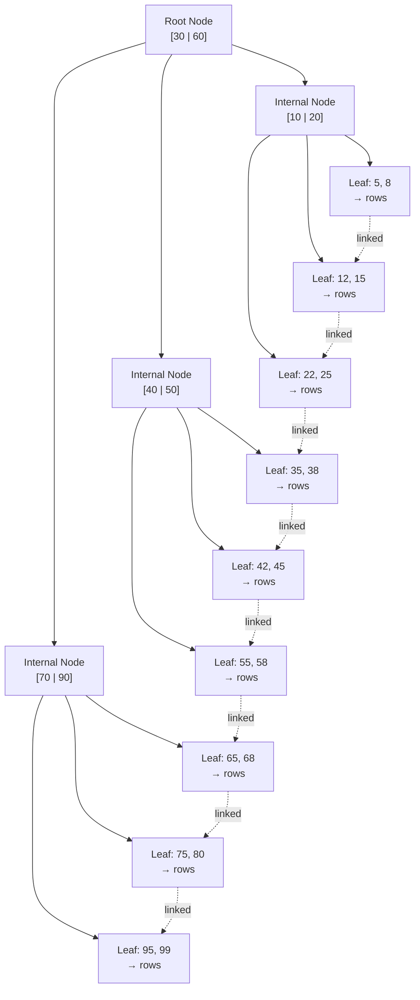
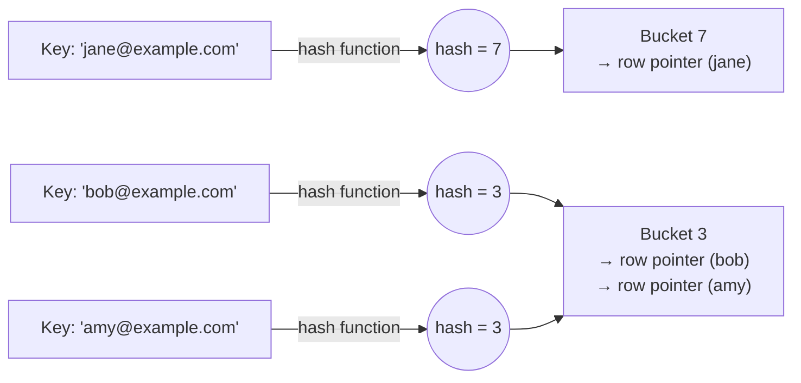
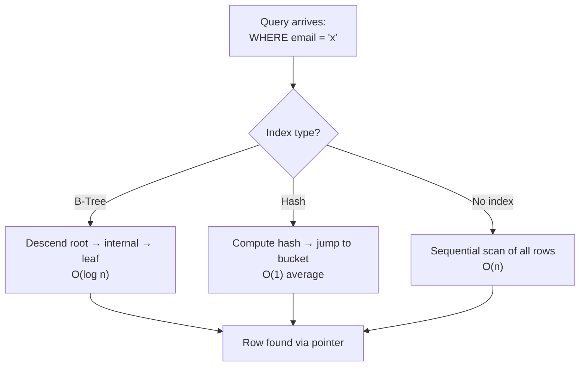

# Diagrams: Database Indexing

## ১. B-Tree (B+Tree) Index Structure

*একটি balanced B+Tree: internal node signpost হিসেবে কাজ করে, leaf node-এ row pointer সহ sorted value থাকে এবং সেগুলো বাম-থেকে-ডান linked, যা দ্রুত exact-match lookup (O(log n) descent) এবং দক্ষ range scan (linked leaf-এর মধ্য দিয়ে হাঁটা) উভয়ই সম্ভব করে।*

## ২. Hash Index Structure

*একটি hash index প্রতিটি key-কে একটি hash function-এর মধ্য দিয়ে চালিয়ে সরাসরি একটি bucket-এ চলে যায় (গড়ে O(1) lookup); সংঘর্ষে জড়ানো key (bob এবং amy উভয়েই hash হয়ে 3-তে পড়ে) একই bucket-এর মধ্যে chain হয়ে যায়, এবং bucket-গুলোর মধ্যে কোনো ordering নেই, তাই range query সম্ভব নয়।*

## ৩. Query Path তুলনা

*একই row-তে পৌঁছানোর তিনটি পথ: একটি B-Tree descent, একটি সরাসরি hash-bucket jump, অথবা — কোনো index না থাকলে — একটি সম্পূর্ণ linear scan।*
