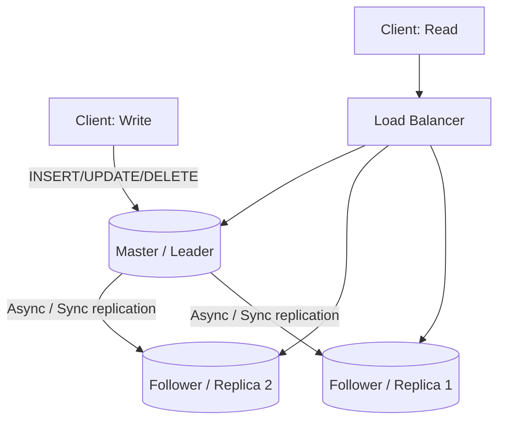
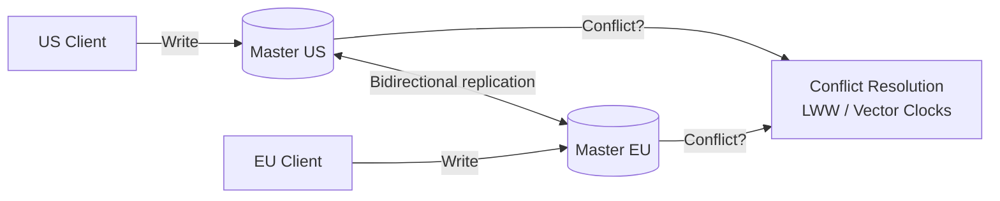
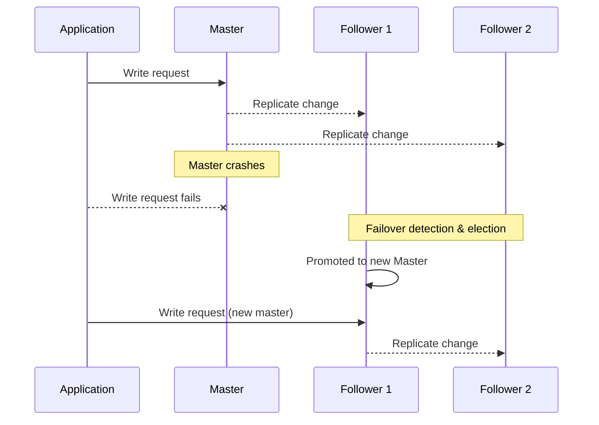

# ডায়াগ্রাম: Database Replication

## ১. Master-Slave (Leader-Follower) Replication

*ক্যাপশন: সব write একটি একক master-এ যায়, যা পরিবর্তনগুলো follower-দের কাছে স্ট্রিম করে; read master এবং যেকোনো follower জুড়ে বিতরণ করে read ক্ষমতা scale করা যায়।*

## ২. Master-Master (Multi-Leader) Replication

*ক্যাপশন: একাধিক master প্রত্যেকে স্থানীয়ভাবে write গ্রহণ করে এবং একে অপরের কাছে replicate করে; একই রেকর্ডে একযোগে write হলে অবশ্যই conflict resolution-এর মধ্য দিয়ে যেতে হবে।*

## ৩. Master-Slave Replication-এ Failover ক্রম

*ক্যাপশন: master ব্যর্থ হলে, write আবার শুরু হওয়ার আগে একটি follower-কে অনুপস্থিত হিসেবে সনাক্ত করতে হয়, নির্বাচিত করতে হয়, এবং promote করতে হয় — এই ফাঁকটিই failover window।*
