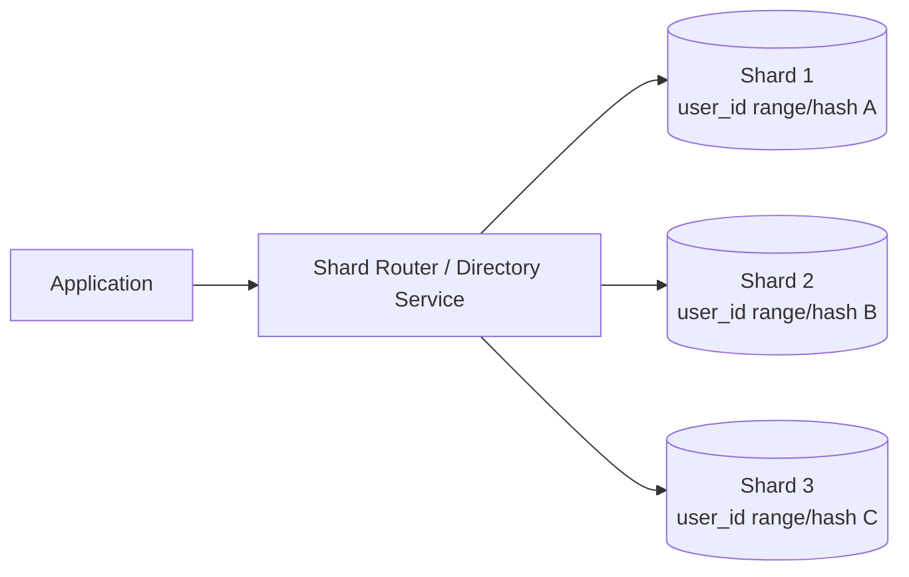
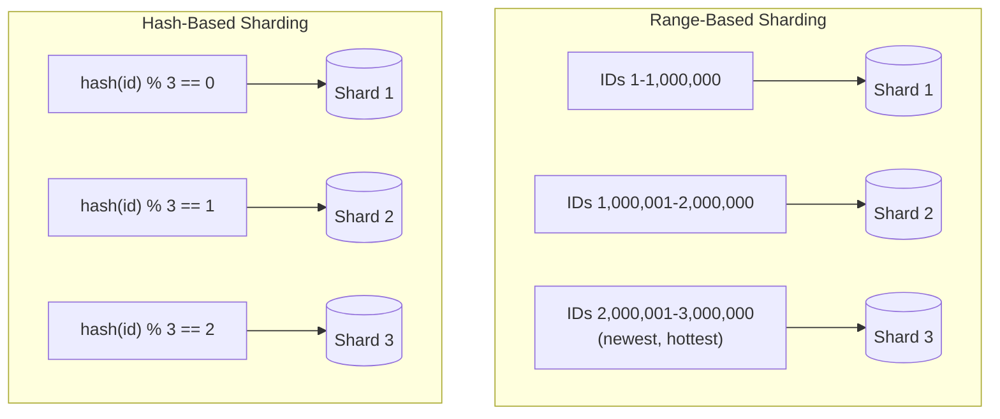
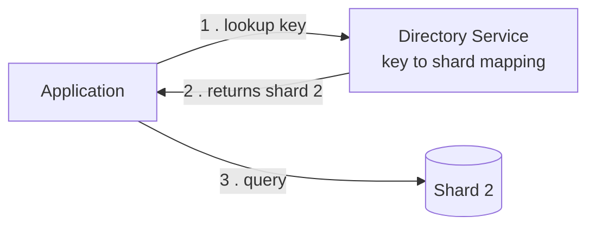

# Diagrams: Database Sharding & Partitioning

## ১. Sharded Database Layout (Application → Router → Shards)

*Application কখনও সরাসরি shard-এর সাথে কথা বলে না — একটি router (বা lookup/directory service) প্রতিটি request-এ shard key পরীক্ষা করে এবং যে একটি shard সেই ডেটার মালিক তার কাছে forward করে।*

## ২. Range-Based বনাম Hash-Based Key Distribution

*Range-based sharding contiguous key-গুলোকে একসাথে রাখে (range scan-এর জন্য চমৎকার, কিন্তু নতুন/sequential traffic একটি shard-এ জমা হয়ে যায়); hash-based sharding key-গুলোকে pseudo-randomly ছড়িয়ে দেয় (সমান load, কিন্তু সস্তা range scan নেই)।*

## ৩. Directory-Based Sharding Lookup

*Directory-based sharding "কোন shard এই key-এর মালিক" তা resolve করতে একটি অতিরিক্ত network hop যোগ করে, কিন্তু এর বিনিময়ে individual key-গুলোকে কোনো কঠোর formula ছাড়াই স্বাধীনভাবে সরানো বা rebalance করতে দেয়।*
