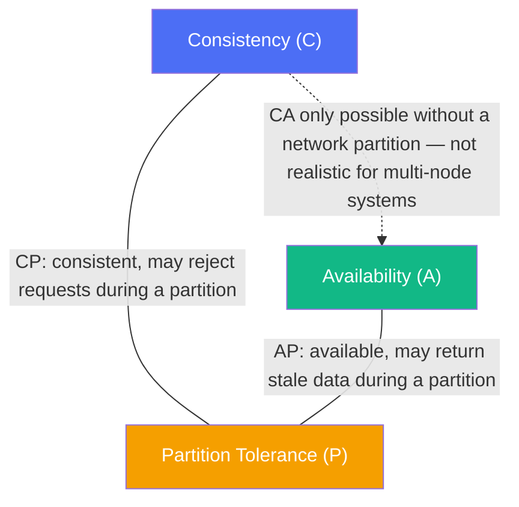
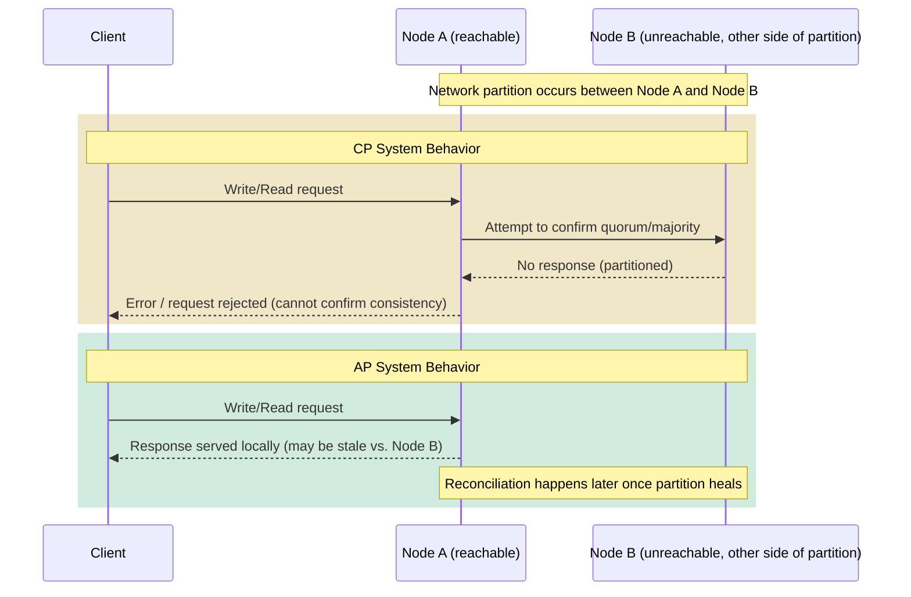
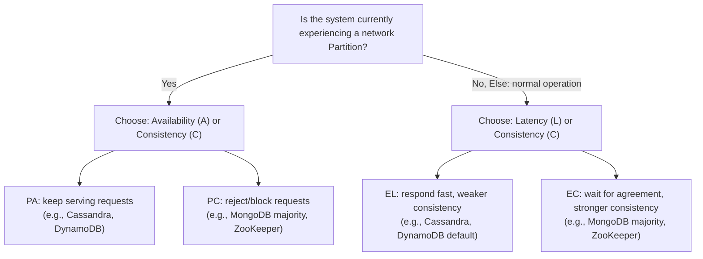

# ডায়াগ্রাম: CAP Theorem ও PACELC

Mermaid-এর কোনো native triangle/Venn shape নেই, তাই নিচের CAP সম্পর্কটি তিনটি বৈশিষ্ট্যের একটি graph হিসেবে আনুমানিকভাবে দেখানো হয়েছে, যেখানে "দুটি বেছে নাও" জুটিগুলো চিহ্নিত করা আছে।

## ১. CAP Theorem — তিনটির মধ্যে দুটি বেছে নাও

*Caption: একটি distributed system একই সময়ে Consistency, Availability, এবং Partition Tolerance-এর মধ্যে শুধু দুটির সম্পূর্ণ guarantee দিতে পারে — যেহেতু partition অনিবার্য, বাস্তব সিস্টেমগুলোকে CP বা AP বেছে নিতে হয়।*

## ২. একটি Network Partition-এর সময় Read/Write — CP বনাম AP

*Caption: একটি CP system-এ, Node A request প্রত্যাখ্যান করে যখন এটি partition-এর অপরপাশে থাকা Node B-র সাথে সমঝোতা নিশ্চিত করতে পারে না; একটি AP system-এ, Node A সাথে সাথে জবাব দেয় এবং partition সেরে যাওয়ার পর যেকোনো বিচ্যুতি মিলিয়ে নেয়।*

## ৩. PACELC সিদ্ধান্ত প্রবাহ

*Caption: PACELC একটি দ্বিতীয় সিদ্ধান্ত যোগ করে যা partition ছাড়াও প্রযোজ্য — স্বাভাবিক কার্যক্রমের সময় Latency-কে Consistency-র বিনিময়ে দেওয়া।*
