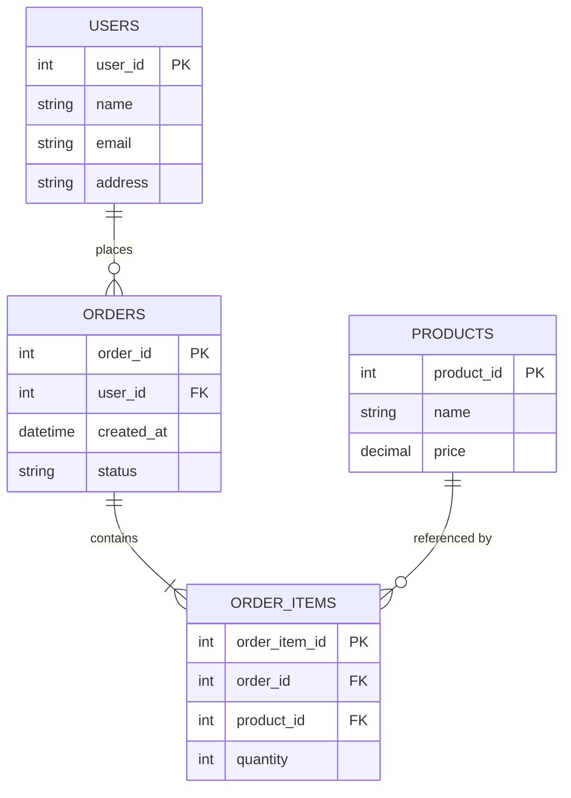
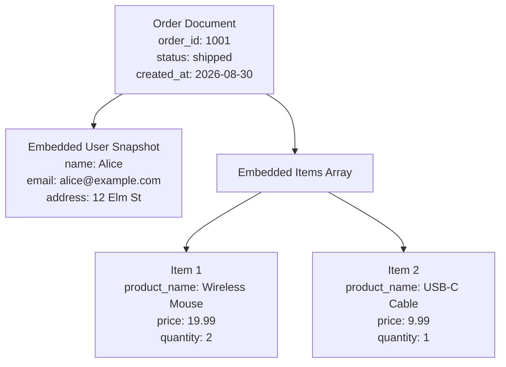
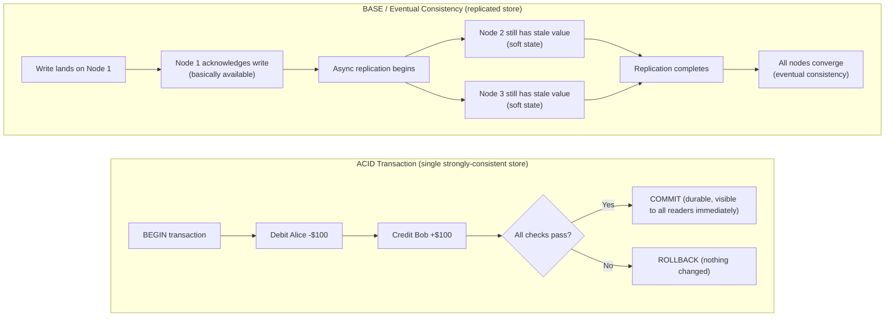

# Diagrams: ACID vs BASE, Normalization vs Denormalization

## ১. Normalized Relational Schema

*Caption: একটি normalized schema প্রতিটি তথ্য একবার সংরক্ষণ করে (user address, product price) এবং foreign key-এর মাধ্যমে রেকর্ড লিঙ্ক করে — আপডেট ঠিক একটি জায়গায় ঘটে।*

## ২. Denormalized Document Model (একই Data)

*Caption: একটি denormalized document অর্ডারের ভেতরেই সরাসরি user এবং product data embed করে — একটি read-এই সবকিছু পাওয়া যায়, কিন্তু Alice-এর ঠিকানা এখন তার প্রতিটি অর্ডারে নকল হয়ে গেছে।*

## ৩. ACID Transaction Lifecycle vs Eventual Consistency Propagation

*Caption: ACID write স্বীকার করার আগেই correctness নিশ্চিত করে (reader-রা কখনো partial state দেখে না); BASE সাথে সাথেই স্বীকার করে নেয় এবং correctness-কে সময়ের সাথে replica জুড়ে ধরে ফেলতে দেয়।*
