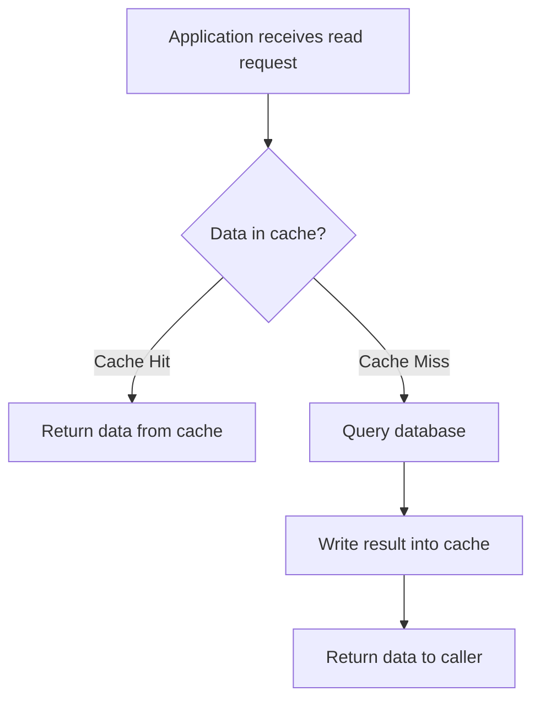
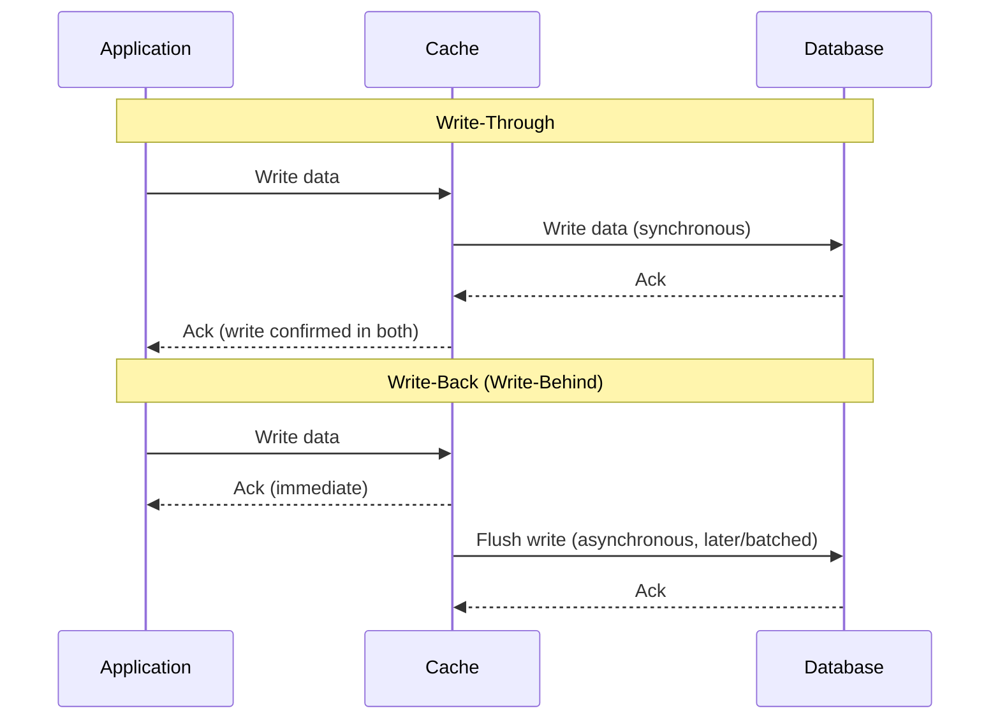
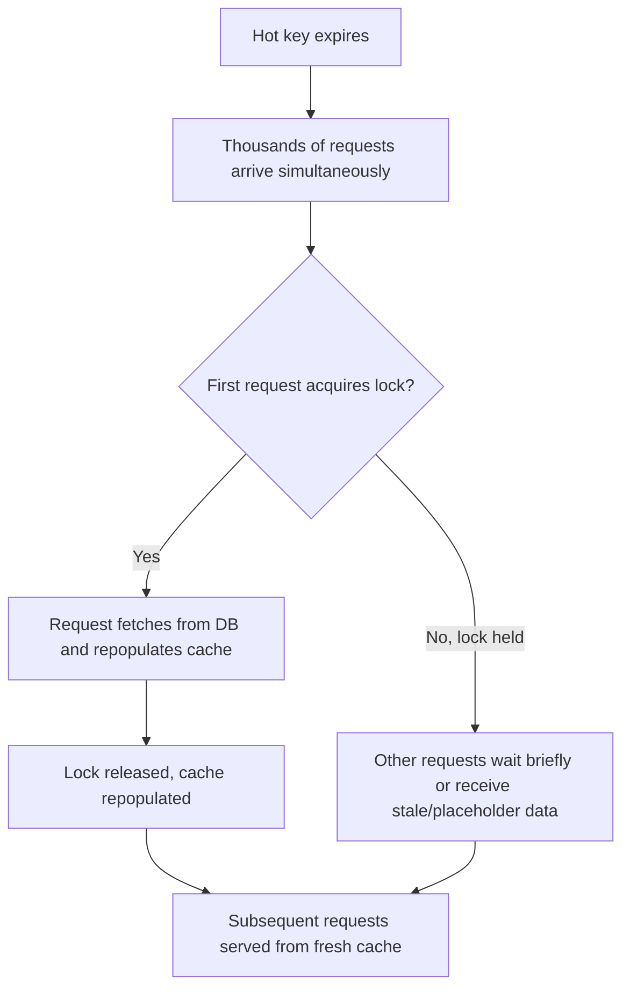

# ডায়াগ্রাম: Caching Strategies & Cache Invalidation

## ১. Cache-Aside Read Flow

*Caption: cache-aside-এ, অ্যাপ্লিকেশন প্রথমে cache চেক করে এবং শুধুমাত্র miss হলে database-এর দিকে ফিরে যায়, পরে cache পূরণ করে।*

## ২. Write-Through বনাম Write-Back Sequence

*Caption: write-through শুধুমাত্র cache এবং DB উভয়ই আপডেট হওয়ার পরে নিশ্চিত করে; write-back তাৎক্ষণিকভাবে নিশ্চিত করে এবং asynchronously database-এ flush করে।*

## ৩. Request Coalescing দিয়ে Cache Stampede প্রশমন

*Caption: request coalescing নিশ্চিত করে যে শুধুমাত্র একটি request একটি hot cache key পুনরায় পূরণ করে, যখন বাকিগুলো অপেক্ষা করে বা একটি stale fallback পায়, এভাবে database-কে একটি stampede থেকে রক্ষা করে।*
