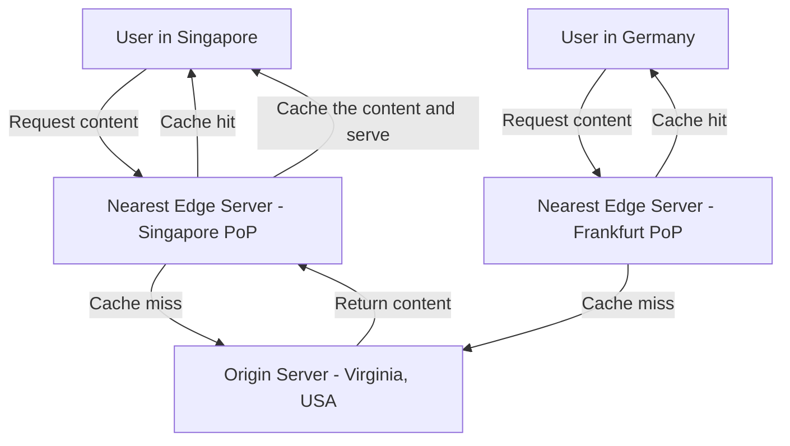
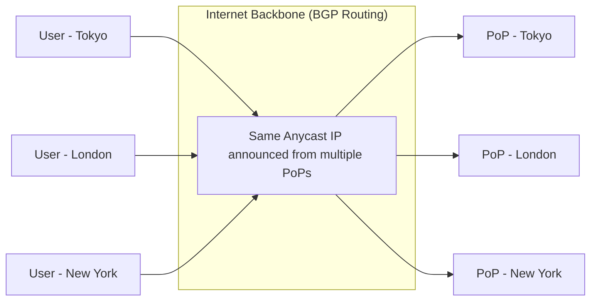
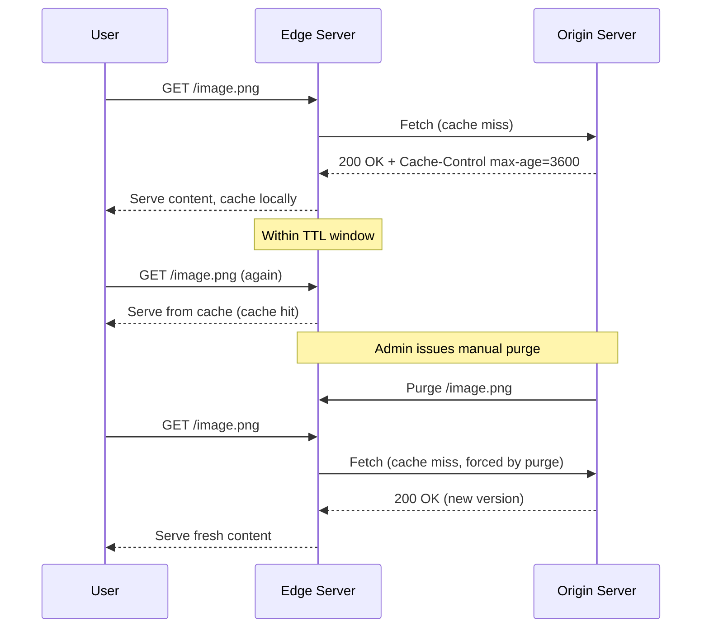

# Diagrams: CDN (Content Delivery Network) Explained

## ১. CDN Request Routing: Edge বনাম Origin

*Caption: Request-গুলো ভৌগোলিকভাবে নিকটতম edge server-এ route করা হয়; শুধুমাত্র cache miss-ই দূরবর্তী origin পর্যন্ত পুরোটা ভ্রমণ করে।*

## ২. নিকটতম PoP-তে Anycast Routing

*Caption: Anycast-এ, সব PoP একই IP address share করে; BGP routing স্বয়ংক্রিয়ভাবে প্রতিটি user-এর traffic-কে topologically নিকটতম PoP-তে পরিচালিত করে।*

## ৩. CDN Cache Lifecycle: TTL Expiration এবং Purge

*Caption: Edge server-গুলো cached content serve করতে থাকে যতক্ষণ না TTL শেষ হয় অথবা একটি explicit purge origin-এর বিরুদ্ধে revalidation বাধ্য করে।*
