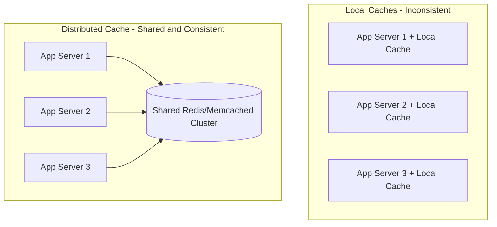
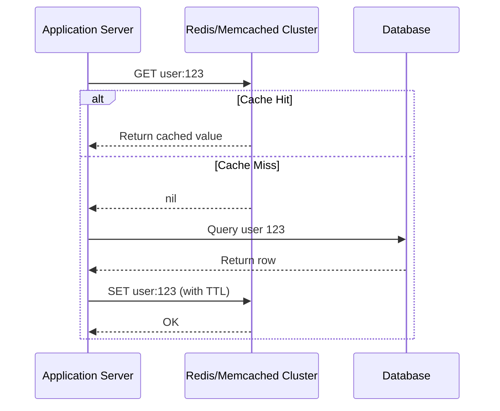
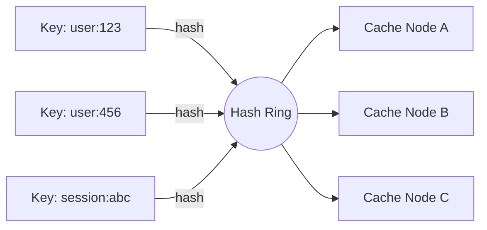

# ডায়াগ্রাম: Distributed Caching with Redis & Memcached

## ১. Local Cache বনাম Distributed Cache স্থাপত্য

*Caption: Local cache প্রতিটি server-এ পৃথক, অসামঞ্জস্যপূর্ণ কপি তৈরি করে; একটি distributed cache প্রতিটি server-কে cached data-এর একই shared দৃশ্য দেয়।*

## ২. Distributed Cache Read/Write Flow (একটি Redis Cluster-এর সাথে Cache-Aside)

*Caption: Application server distributed cache cluster-কে একটি একক shared endpoint হিসেবে গণ্য করে, এর উপরে cache-aside logic প্রয়োগ করে।*

## ৩. একটি Cache Cluster জুড়ে Key Sharding করা (Consistent Hashing)

*Caption: Key-গুলো একটি ring-এ hash করা হয় এবং নিকটতম cache node-এ map করা হয়, তাই একটি node যোগ বা বাদ দিলে শুধু অল্প কিছু key-ই পুনরায় map হয়।*
