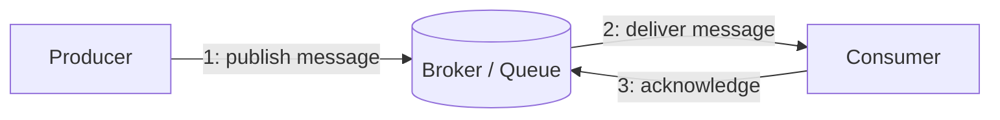
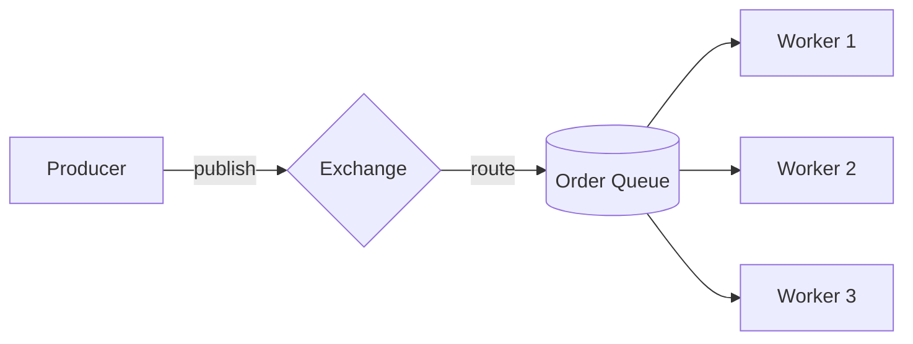
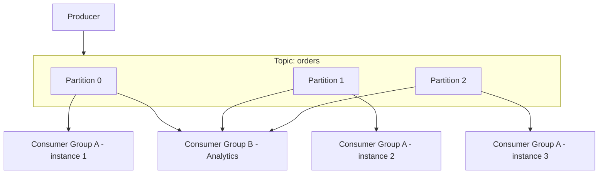

# ডায়াগ্রাম: Message Queues, Kafka vs RabbitMQ

## ১. Message Queue-এর মাধ্যমে মৌলিক Producer-Consumer Flow

*একজন producer broker-কে একটি message publish করে এগিয়ে যায়; consumer সেটিকে স্বাধীনভাবে প্রসেস করে এবং সম্পন্ন হওয়ার acknowledgment দেয়।*

## ২. Consumer Group-সহ RabbitMQ-স্টাইল Routing

*RabbitMQ একটি exchange-এর মাধ্যমে message-কে একটি queue-তে রুট করে; একাধিক worker message-এর জন্য প্রতিযোগিতা করে, প্রতিটি message ঠিক একজন worker দ্বারা সামলানো হয়।*

## ৩. Kafka Topic, Partitions, এবং স্বতন্ত্র Consumer Groups

*Kafka একটি group-এর মধ্যে সমান্তরাল consumption-এর জন্য একটি topic-কে partition করে, আর সম্পূর্ণ আলাদা consumer group-রা স্বাধীনভাবে একই ডেটা replay করতে পারে।*
</content>
