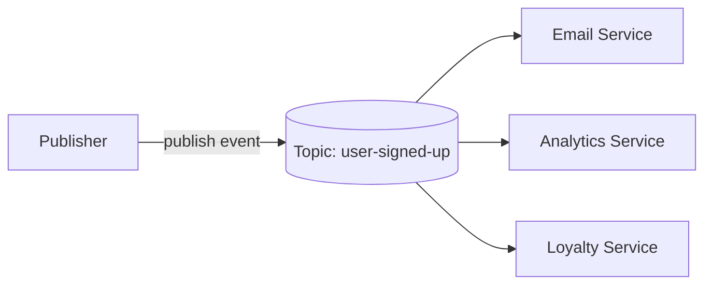
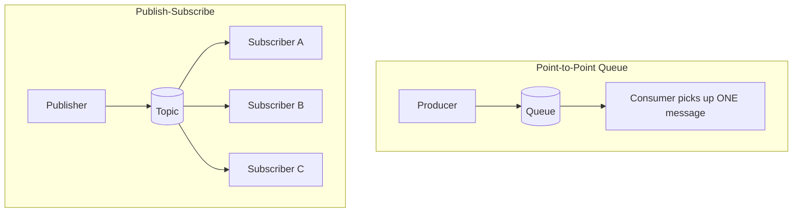
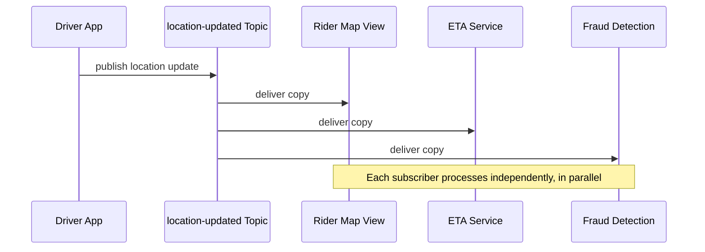

# ডায়াগ্রাম (Diagrams): Publish-Subscribe Pattern

## ১. মৌলিক Pub-Sub Fan-Out

*একটা publish করা event তিনজন স্বাধীন subscriber-এর কাছে fan out হয়, যাদের কারো সম্পর্কেই publisher অবগত নয়।*

## ২. Point-to-Point Queue বনাম Pub-Sub পাশাপাশি

*একটা queue প্রতিটা message একজন মাত্র consumer-এর কাছে পৌঁছে দেয়; একটা topic প্রতিটা message প্রতিটা subscriber-এর কাছে পৌঁছে দেয়।*

## ৩. একটা Ride-Sharing Location Update Event-এর Sequence

*একটা একক location update event স্বাধীনভাবে তিনটা অসম্পর্কিত downstream service-এ পৌঁছে দেওয়া হয়।*
</content>
