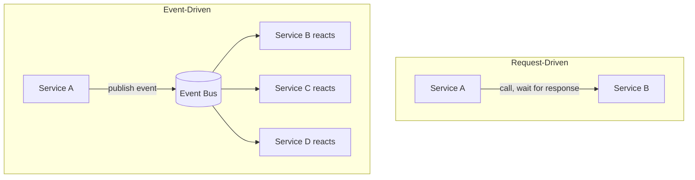
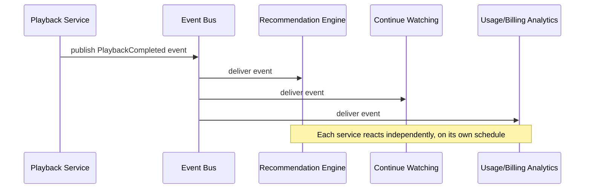
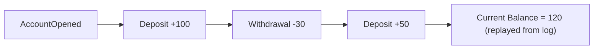

# ডায়াগ্রাম: Event-Driven Architecture

## ১. Request-Driven বনাম Event-Driven Control Flow

*Request-driven flow একটি সরাসরি call-এ block হয়ে থাকে; event-driven flow যেকোনো সংখ্যক services-কে স্বাধীনভাবে এবং asynchronously প্রতিক্রিয়া জানাতে দেয়।*

## ২. Event-Driven প্রতিক্রিয়া Chain (Netflix-ধাঁচের উদাহরণ)

*একটি একক "playback completed" event তিনটি স্বাধীন, decoupled প্রতিক্রিয়া trigger করে।*

## ৩. Event Sourcing: একটি Event Log থেকে উদ্ভূত State

*Event sourcing-এ, বর্তমান state সরাসরি সংরক্ষণ করার বদলে events-এর সম্পূর্ণ history replay করে গণনা করা হয়।*
</content>
