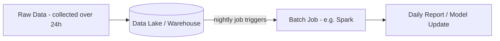
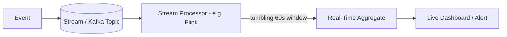
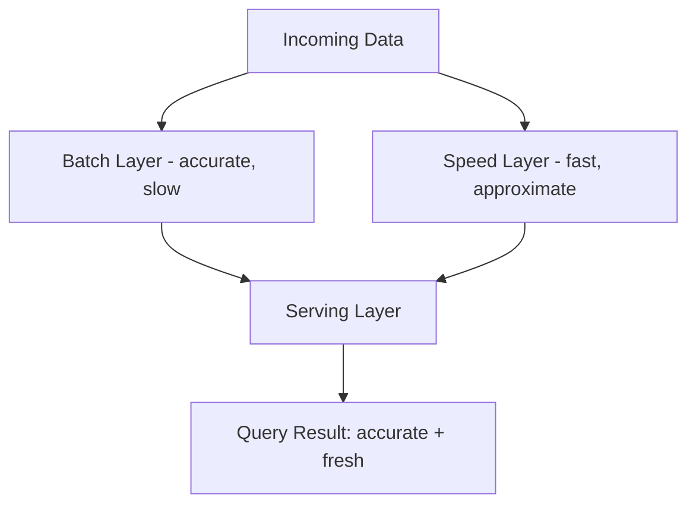

# Diagrams: Batch বনাম Stream Processing

## ১. Batch Processing Flow

*একটা bounded window ধরে ডেটা জমা হয়, তারপর একটা single batch job একবারে সবকিছু প্রসেস করে।*

## ২. Windowing সহ Stream Processing Flow

*Events যেভাবে আসে সেভাবে ক্রমাগত প্রসেস করা হয়, near real-time ফলাফলের জন্য ছোট time window-এ aggregate করা হয়।*

## ৩. Lambda Architecture: Batch এবং Speed Layers মিলিত

*Lambda architecture ডেটাকে একটা ধীর accurate batch layer এবং একটা দ্রুত approximate speed layer উভয়ের মধ্য দিয়ে চালায়, এবং query time-এ দুটো view merge করে।*
