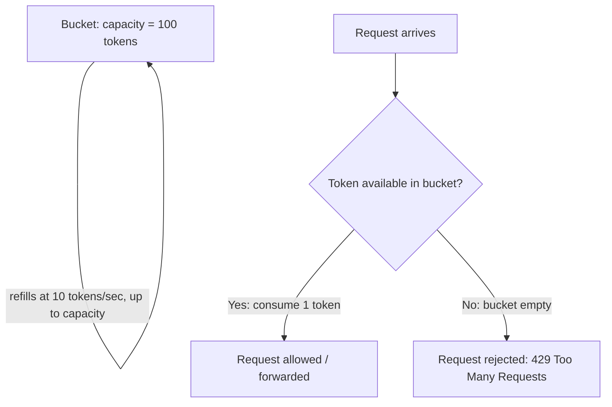
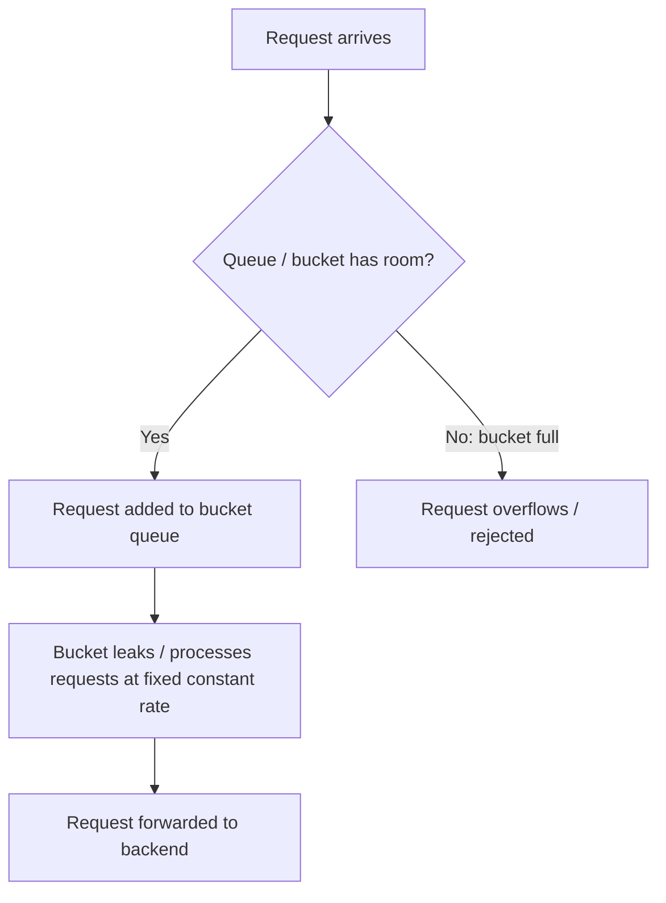
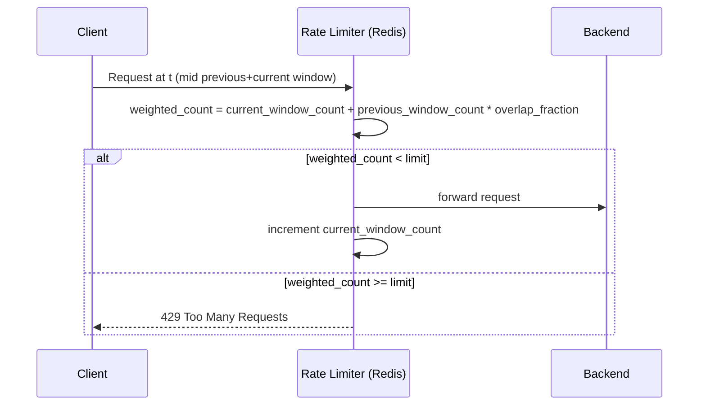

# Diagrams: Rate Limiting Algorithms

## Token Bucket প্রবাহ (Token Bucket Flow)

*ক্যাপশন: Token গুলো bucket-এর capacity পর্যন্ত ক্রমাগত রিফিল হয়; প্রতিটি request একটি token consume করে, তাই নিষ্ক্রিয় সময় burst-কে token শেষ না হওয়া পর্যন্ত তাৎক্ষণিকভাবে পাস হতে দেয়।*

## Leaky Bucket প্রবাহ (Leaky Bucket Flow)

*ক্যাপশন: Request গুলো bucket-এ queue হয় এবং একটি কঠোরভাবে স্থির হারে ব্যাকএন্ডে drain হয়, আগত traffic যতই burst-প্রবণ হোক না কেন তা নির্বিশেষে।*

## Sliding Window Counter ধারণা (Sliding Window Counter Concept)

*ক্যাপশন: Sliding window counter পূর্ববর্তী এবং বর্তমান fixed-window count মিশ্রিত করে, পূর্ববর্তী window sliding view-এর সাথে কতটা এখনও ওভারল্যাপ করে তা দিয়ে ওজনযুক্ত করে, একটি প্রকৃত sliding log-কে সস্তায় আনুমানিক করে।*
