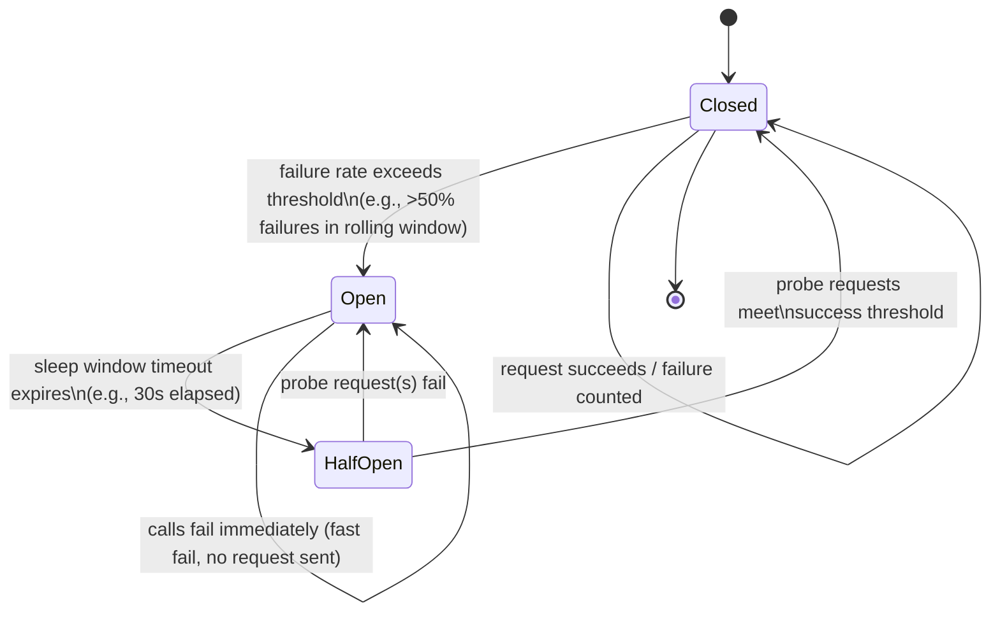
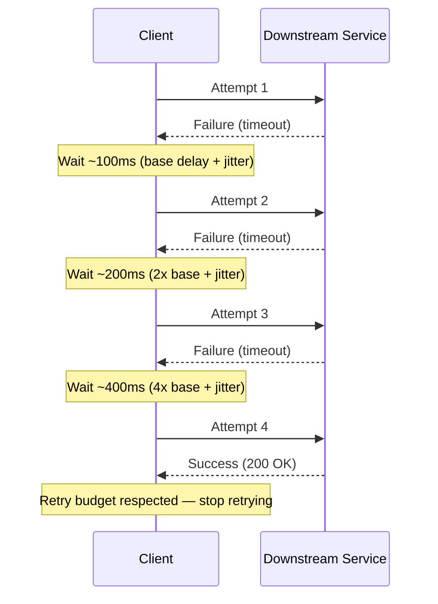
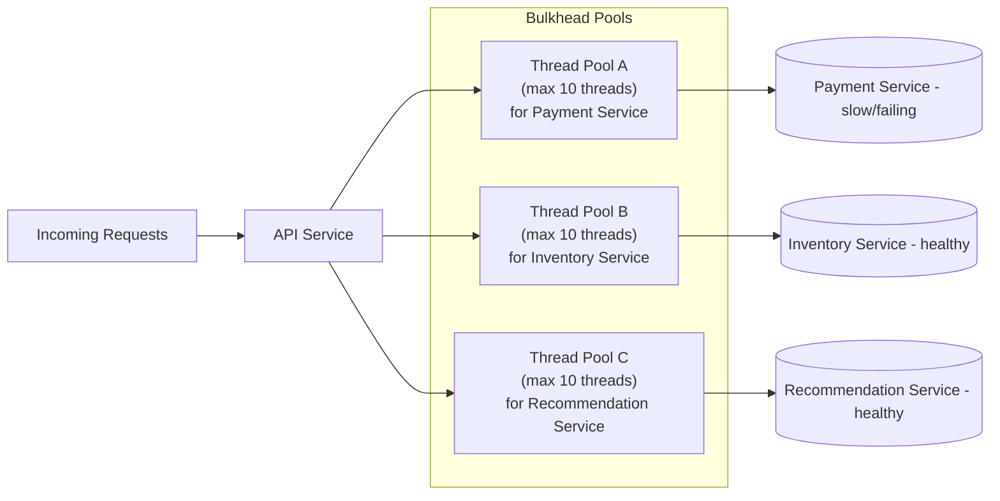

# ডায়াগ্রাম — Circuit Breaker, Retry & Bulkhead Patterns

## ১. Circuit Breaker State Machine

*Caption: Circuit breaker Closed অবস্থায় শুরু হয়, ধারাবাহিক failure-এ Open-এ trip করে, এবং সম্পূর্ণভাবে reset হওয়ার আগে Half-Open-এর মাধ্যমে সতর্কতার সাথে পুনরুদ্ধার probe করে।*

## ২. Exponential Backoff এবং Jitter সহ Retry

*Caption: প্রতিটি retry delay মোটামুটি দ্বিগুণ হয় এবং random jitter অন্তর্ভুক্ত করে, retry গুলো ছড়িয়ে দেয় যাতে অনেক client synchronized wave-এ service-কে আঘাত না করে।*

## ৩. বিভিন্ন Dependency জুড়ে Bulkhead Isolation

*Caption: প্রতিটি downstream dependency তার নিজস্ব সীমিত thread pool পায়, তাই একটি ধীরগতির বা ব্যর্থ Payment Service শুধুমাত্র নিজের pool শেষ করে এবং কখনো Inventory বা Recommendations-এর call গুলোকে অনাহারে রাখে না।*
