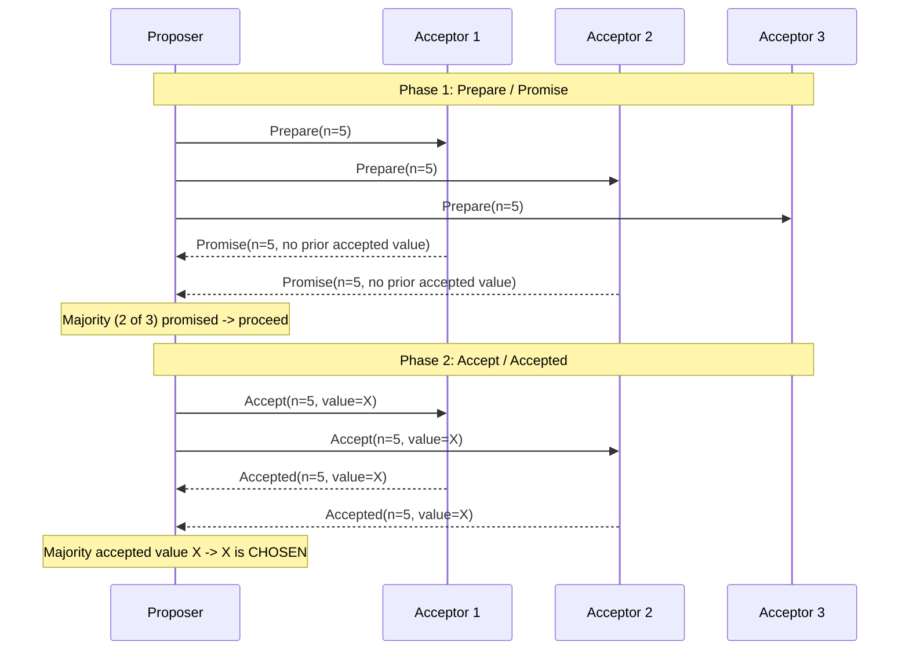
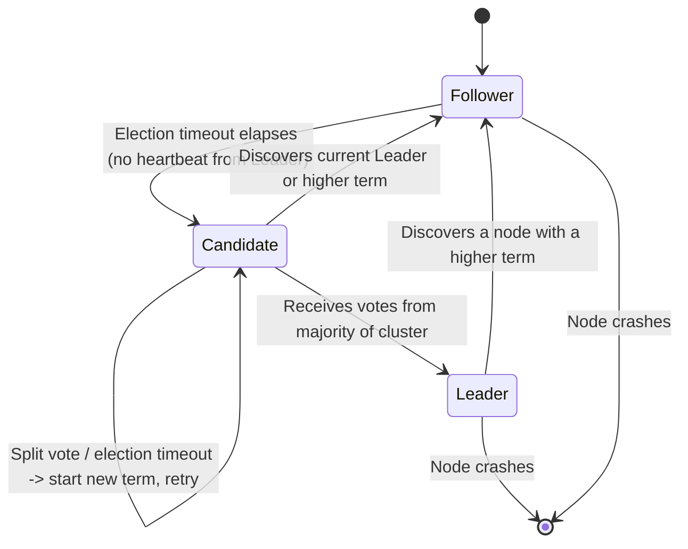
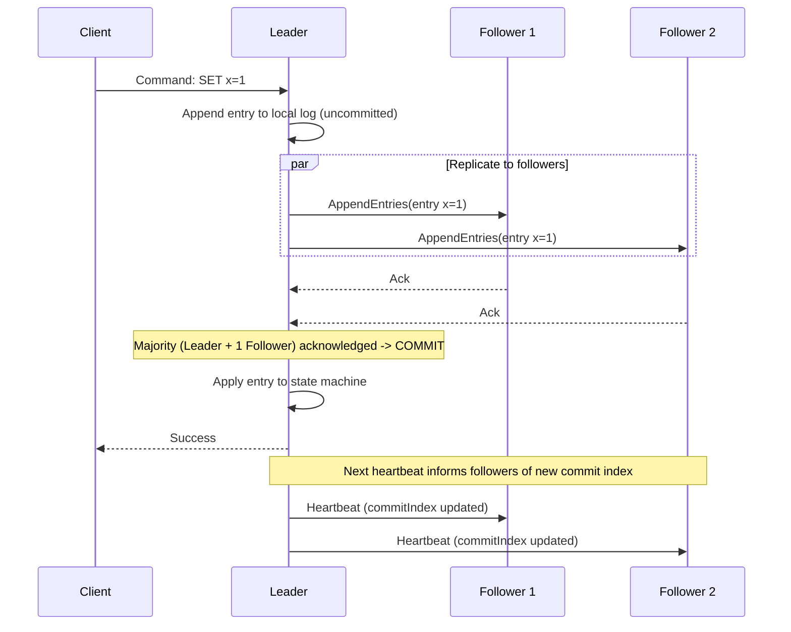

# Diagrams: Consensus Algorithms (Paxos & Raft)

## ১. Paxos — Prepare/Promise এবং Accept/Accepted Phase

*Caption: একটি value chosen হয় একবার Acceptor-দের একটি majority একই proposal number এবং value accept করলে — Proposer-এর কখনো সবগুলো N Acceptor-এর প্রয়োজন হয় না, শুধু একটি quorum প্রয়োজন।*

## ২. Raft — Node State Transitions

*Caption: প্রতিটি Raft node হয় একজন Follower, Candidate, অথবা Leader; একটি randomized election timeout Follower-কে Candidate-এ পরিণত করে, এবং শুধুমাত্র একটি majority vote একজন Candidate-কে সেই term-এর জন্য Leader-এ উন্নীত করে।*

## ৩. Raft — Log Replication

*Caption: Leader একটি log entry কমিট করে যত তাড়াতাড়ি cluster-এর একটি majority (নিজেকে সহ) এটি স্থায়ীভাবে যুক্ত করে ফেলেছে, তারপর পরবর্তী heartbeat-এ Follower-দের নতুন commit index জানিয়ে দেয়।*
