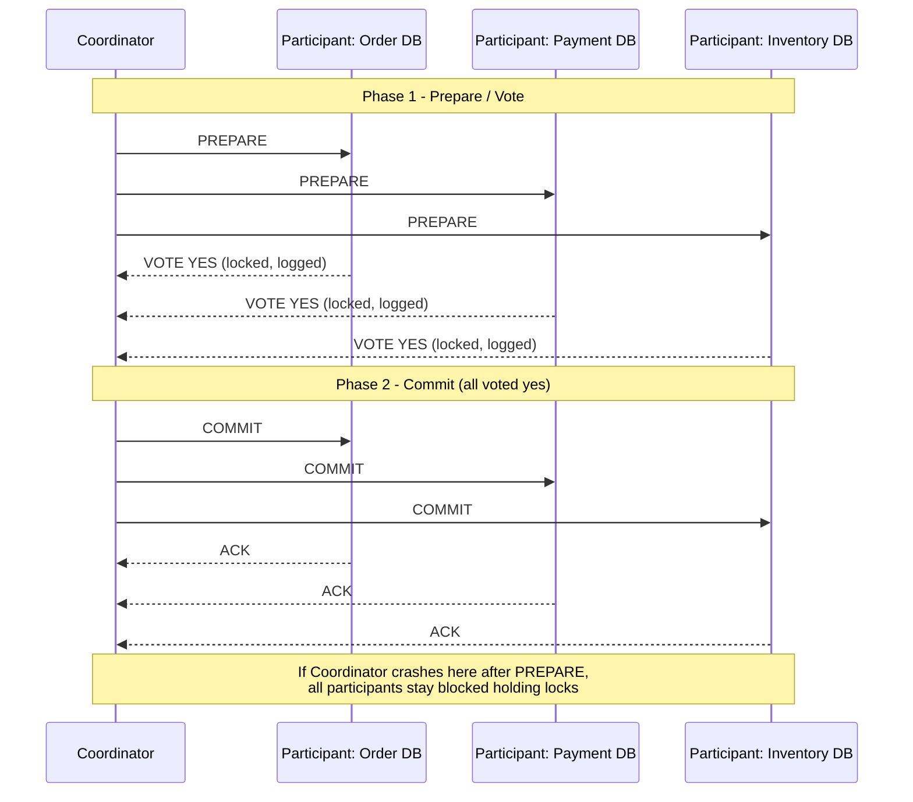
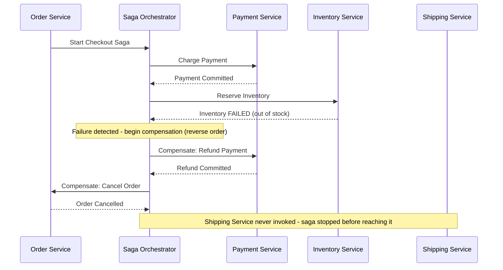
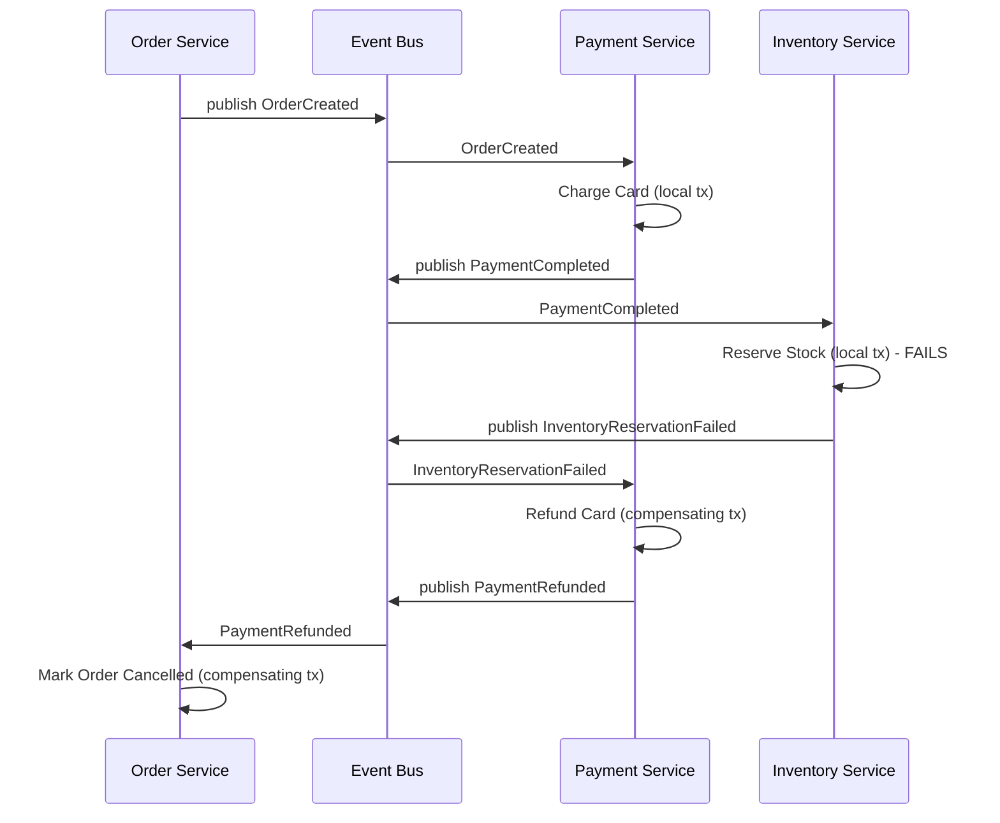

# Diagrams: Distributed Transactions — 2PC ও Saga

## ১. Two-Phase Commit (2PC)

*Caption: Coordinator commit করার আগে 2PC প্রতিটি participant থেকে একটি সর্বসম্মত "হ্যাঁ" vote দাবি করে; Prepare এবং Commit-এর মধ্যে একটি coordinator crash participant-দের block অবস্থায় রেখে দেয়।*

## ২. Orchestration-Based Saga (Failure-এ Compensation-সহ)

*Caption: একটি central orchestrator ক্রমানুসারে প্রতিটি local transaction চালায় এবং downstream-এর কোনো step ব্যর্থ হলে explicitly compensating transaction, বিপরীত ক্রমে, ট্রিগার করে।*

## ৩. Choreography-Based Saga (Event-Driven, কোনো Central Orchestrator নেই)

*Caption: Choreography-তে, প্রতিটি service স্বাধীনভাবে event-এর প্রতিক্রিয়া জানায় এবং failure-এর সময় নিজের compensating transaction চালায় — সামগ্রিক saga state ট্র্যাক করার কোনো central coordinator নেই।*
