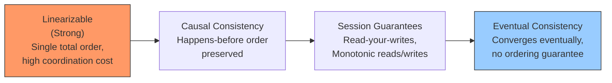
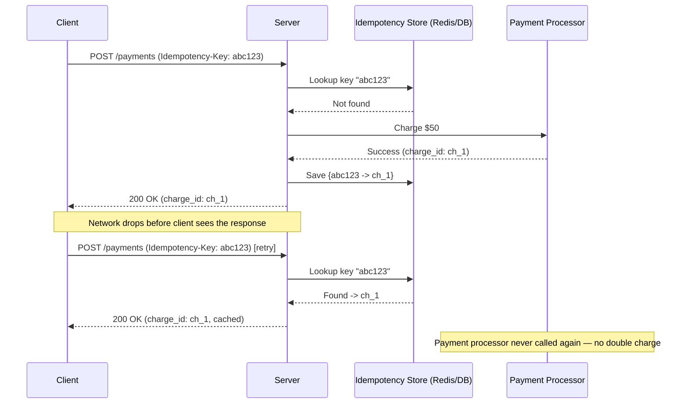
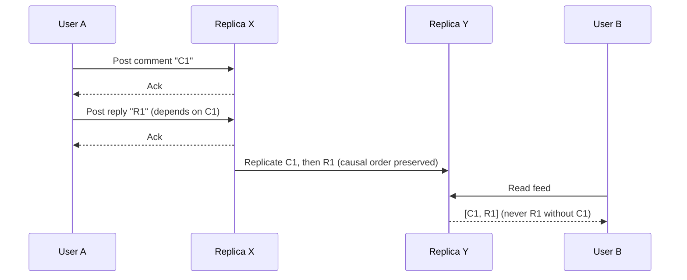

# Diagrams: Data Consistency Models ও Idempotency

Consistency spectrum, সবচেয়ে শক্তিশালী থেকে সবচেয়ে দুর্বল guarantee পর্যন্ত।

*Caption: Consistency model-গুলো একটি spectrum গঠন করে — সবচেয়ে শক্তিশালী guarantee (বামে) coordination এবং availability-তে সবচেয়ে বেশি খরচ করে; সবচেয়ে দুর্বলগুলো (ডানে) availability এবং latency সর্বোচ্চ করে।*

একটি idempotency key দিয়ে একটি payment request retry করা client double charge এড়ায়।

*Caption: Server idempotency key দিয়ে retry deduplicate করে, payment পুনরায় process না করে original result ফেরত দেয়।*

Causal consistency: একটি reply যে comment-এর প্রতিক্রিয়া, তার আগে কখনো দৃশ্যমান হওয়া উচিত নয়।

*Caption: Causal consistency guarantee করে যে একটি "happens-before" সম্পর্ক (reply, comment-এর উপর নির্ভরশীল) সব replica জুড়ে সংরক্ষিত থাকে, যদিও unrelated event তখনও out of order আসতে পারে।*
