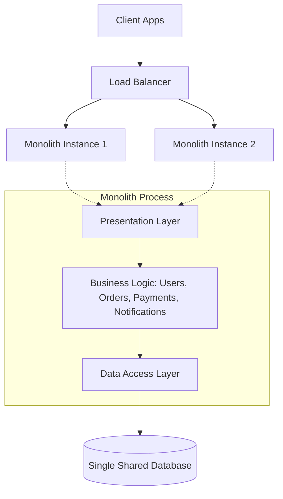
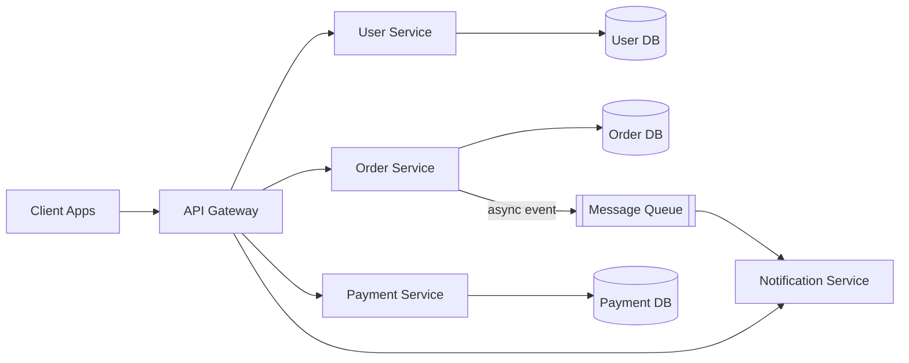
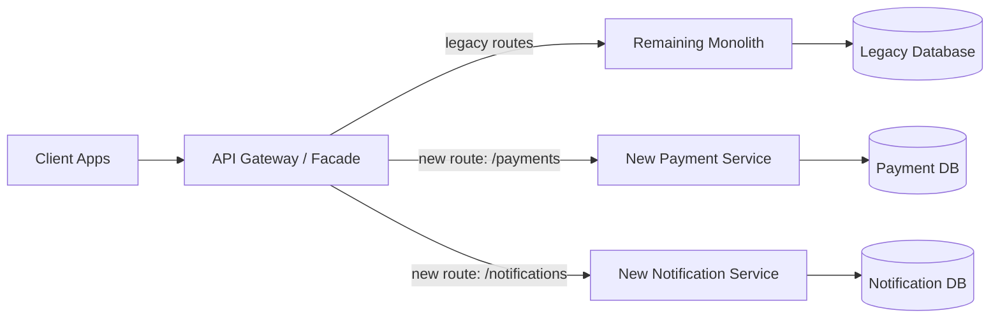

# ডায়াগ্রাম: Monolith vs Microservices

## ১. Monolithic Architecture

*একটি monolith সব module-কে একটি একক unit হিসেবে deploy করে, একটি load balancer-এর পেছনে replicate করা হয়, এবং একটি database share করে।*

## ২. Microservices Architecture

*প্রতিটি microservice স্বাধীনভাবে deployable, নিজস্ব database-এর মালিক, এবং network-এর মাধ্যমে সরাসরি বা একটি message queue-র মাধ্যমে যোগাযোগ করে।*

## ৩. Strangler Fig Migration Path

*Strangler fig pattern নতুন-বের-করা capability-গুলোর জন্য traffic নতুন service-এ route করে, যখন সংকুচিত monolith বাকি সবকিছু সেবা দিতে থাকে।*
</content>
