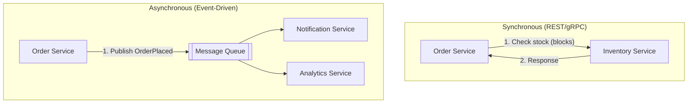
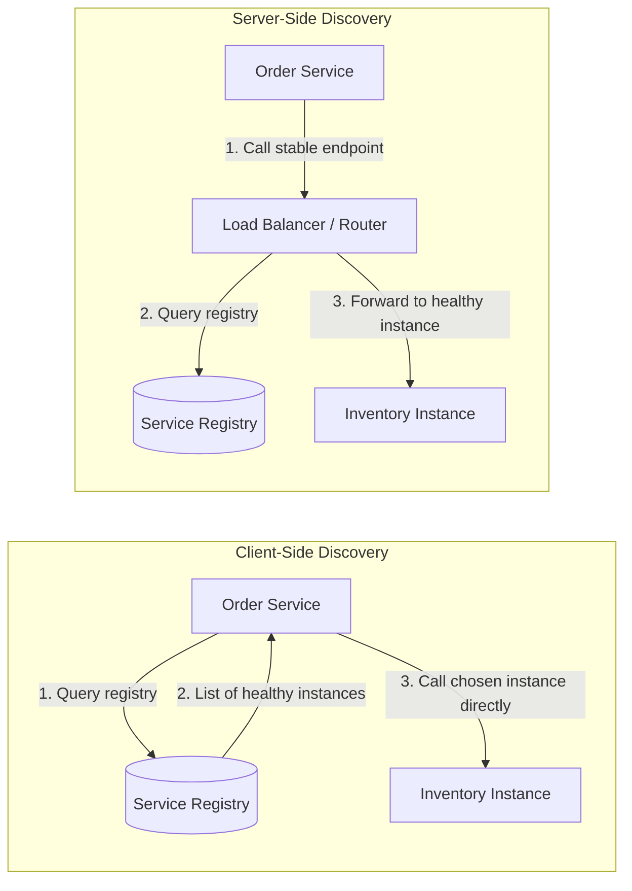
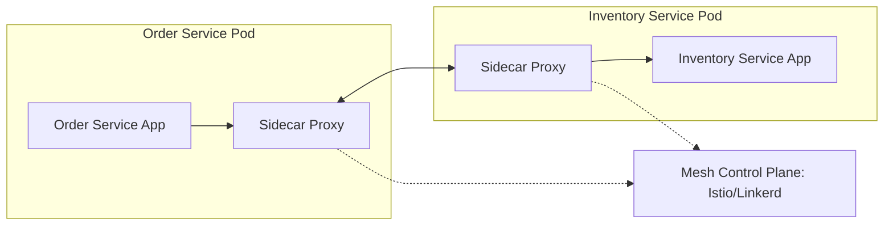

# Diagrams: Microservices Communication ও Service Discovery

## ১. Synchronous বনাম Asynchronous Communication

*Synchronous call তাৎক্ষণিক উত্তরের জন্য block করে; asynchronous event publisher-কে consumer থেকে সময়ের দিক থেকে decouple করে।*

## ২. Client-Side বনাম Server-Side Service Discovery

*Client-side discovery lookup ও load balancing caller-এর মধ্যে রাখে; server-side discovery সেটা একটা load balancer-এর পেছনে লুকিয়ে রাখে।*

## ৩. Sidecar Proxy-সহ Service Mesh

*একটি service mesh-এ, sidecar proxy discovery, load balancing, retries, এবং security সামলায়, আর একটা control plane এগুলো সবকিছু configure করে।*
