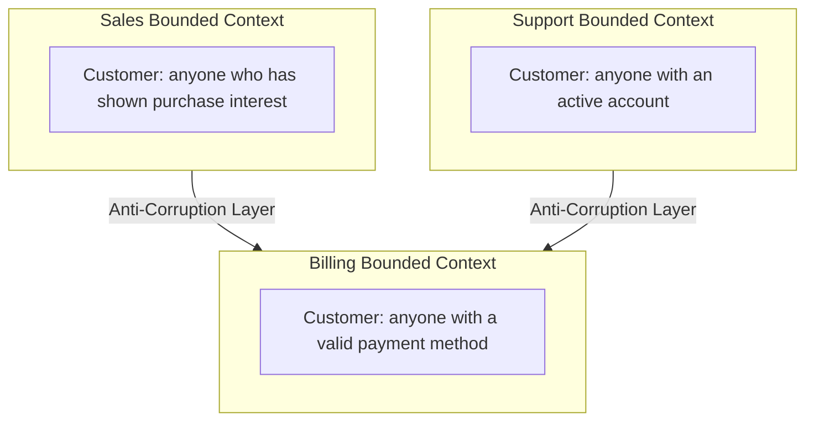
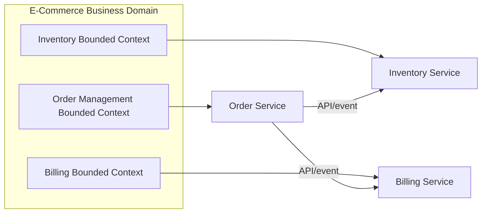
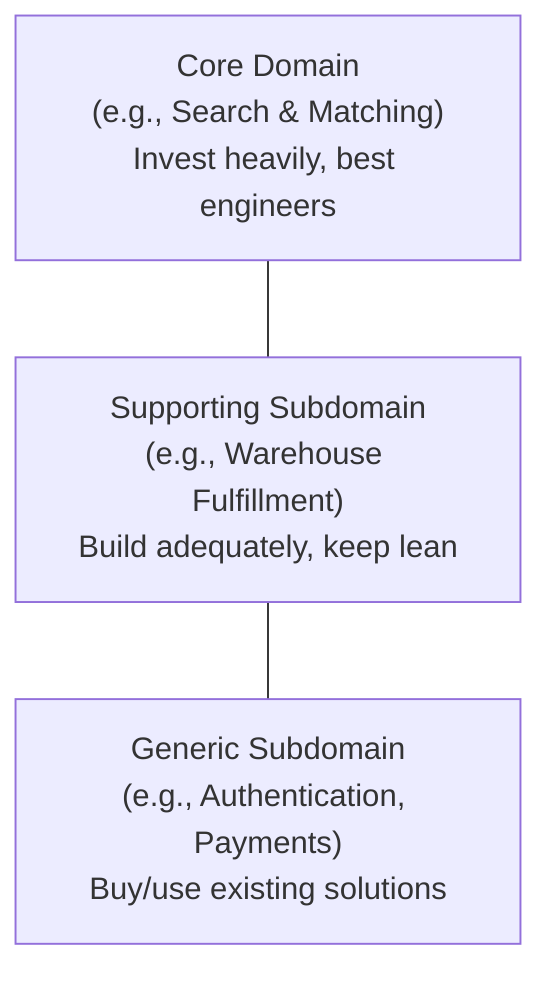

# ডায়াগ্রাম: Domain-Driven Design Basics

## ১. "Customer"-এর ভিন্ন ভিন্ন অর্থসহ Bounded Contexts

*প্রতিটি bounded context-এর "Customer"-এর নিজস্ব মডেল আছে; একটি মডেল শেয়ার করার পরিবর্তে anti-corruption layer এদের মধ্যে অনুবাদ করে।*

## ২. Bounded Contexts-কে Microservices-এ ম্যাপ করা

*প্রতিটি bounded context স্বাভাবিকভাবেই তার নিজস্ব microservice-এ ম্যাপ করে, একটি শেয়ার্ড ডেটাবেসের পরিবর্তে সুনির্দিষ্ট API/ইভেন্টের মাধ্যমে যোগাযোগ করে।*

## ৩. Core, Supporting, এবং Generic Subdomains

*subdomain-গুলোকে শ্রেণিবদ্ধ করা সিদ্ধান্ত নিতে সাহায্য করে কোথায় গভীর কাস্টম ইঞ্জিনিয়ারিং বিনিয়োগ করতে হবে বনাম কোথায় একটি বিদ্যমান সমাধান কিনতে হবে।*
</content>
