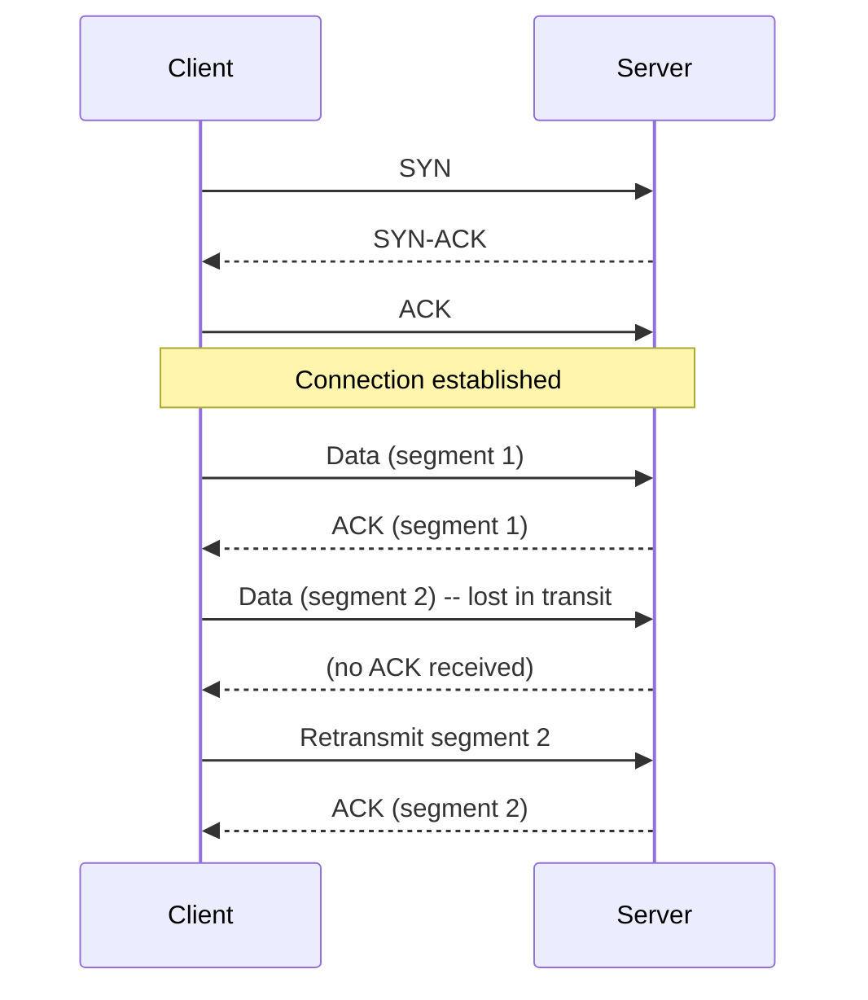
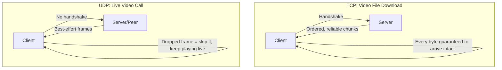
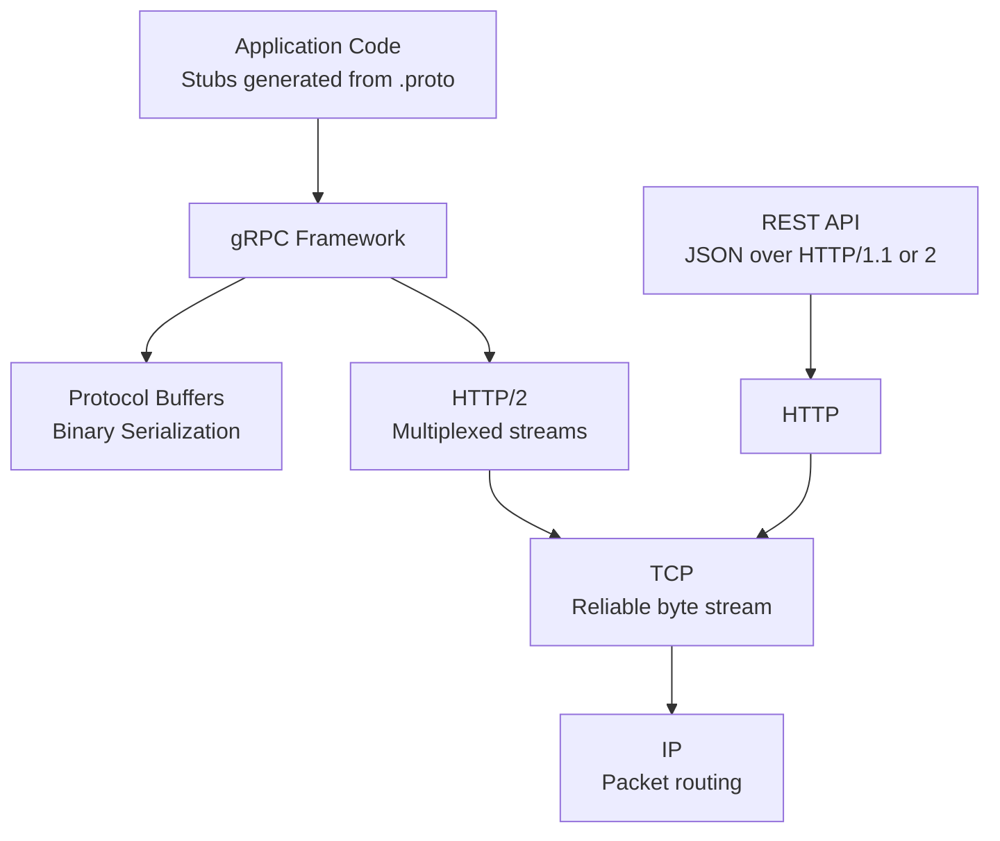

# Diagrams: Transport Protocols — TCP vs UDP এবং gRPC

## ১. TCP Three-Way Handshake, তারপর Data Transfer

*কোনো data প্রবাহিত হওয়ার আগে TCP-এর একটি handshake দরকার, এবং প্রতিটি segment acknowledge করা হয় — একটি হারিয়ে যাওয়া segment স্বয়ংক্রিয়ভাবে retransmit হয়, যা reliable, ordered delivery নিশ্চিত করে।*

## ২. একই কাজের জন্য TCP vs UDP

*একটি file download-এর জন্য প্রতিটি byte অক্ষত থাকা দরকার, তাই TCP-এর retransmission-এর খরচটা এখানে সার্থক। একটি live call-এর জন্য completeness-এর চেয়ে freshness বেশি দরকার, তাই UDP-এর "drop করো এবং এগিয়ে যাও" মডেলই জেতে।*

## ৩. Stack-এ gRPC কোথায় বসে

*gRPC হলো HTTP/2-এর (যা নিজেই TCP-এর উপর) উপর একটি layer, যা JSON-এর বদলে Protocol Buffers ব্যবহার করে এবং HTTP/2-এর multiplexed streaming পায় — যেখানে REST সাধারণত plain HTTP-এর উপর JSON-এই থেকে যায়।*
