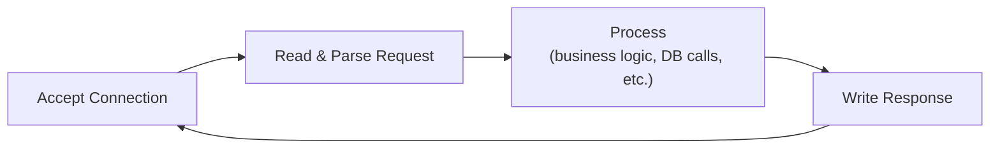
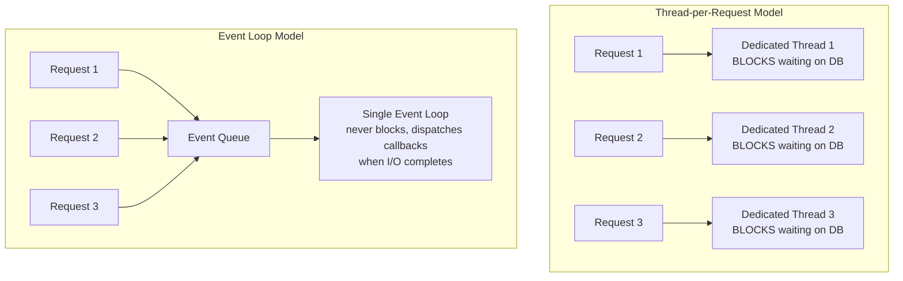
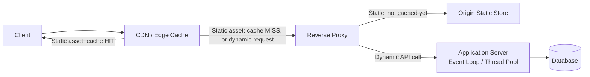

# Diagrams: Web Server Internals

## ১. Web Server-এর মূল Loop

*প্রতিটি web server প্রতিটি request-এর জন্য এই loop পুনরাবৃত্তি করে — performance এবং scalability সম্পূর্ণভাবে নির্ভর করে অনেক request-এর জন্য concurrently ধাপ ৩ ("Process") কীভাবে হ্যান্ডেল করা হয় তার উপর।*

## ২. Thread-per-Request বনাম Event Loop

*Thread-per-request একটি blocking DB call-এর পুরো সময়কাল জুড়ে, যতক্ষণই লাগুক না কেন, একটি সম্পূর্ণ OS thread আটকে রাখে। একটি event loop I/O জারি করে এগিয়ে যায়, response প্রস্তুত হলেই শুধু সেই request-এ ফিরে আসে — যা একটি thread-কে হাজার হাজার "অপেক্ষমাণ" request সার্ভ করতে দেয়।*

## ৩. Static বনাম Dynamic Request কোথায় হ্যান্ডেল হয়

*Static content যত তাড়াতাড়ি সম্ভব ধরে ফেলা হয় — আদর্শভাবে CDN-এ — যাতে এটি কখনো application server-এর concurrency model স্পর্শ না করে। শুধুমাত্র প্রকৃত dynamic request গুলোই app server এবং তার database পর্যন্ত পৌঁছায়।*
