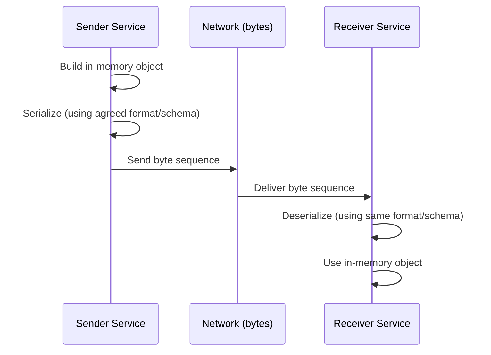
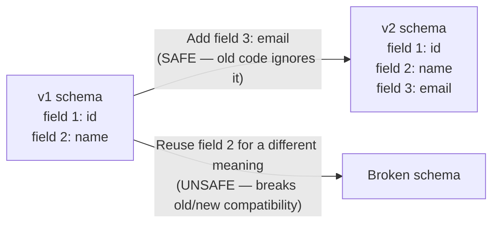

# ডায়াগ্রাম: Message Formats — JSON, XML & Protocol Buffers

## ১. তিনটি ভিন্ন Format-এ একই Message

```mermaid
flowchart TB
    subgraph JSON["JSON (text, ~46 bytes)"]
        J["{"id": 123, "name": "Alice"}"]
    end
    subgraph XML["XML (text, ~64 bytes)"]
        X["<user><id>123</id><name>Alice</name></user>"]
    end
    subgraph PB["Protocol Buffers (binary, ~10 bytes)"]
        P["field 1: varint 123, field 2: len-prefixed 'Alice'"]
    end
```

*একই logical data, তিনটি ভিন্ন encoding — JSON এবং XML প্রতিটি message-এ field name/tag text হিসেবে পুনরাবৃত্তি করে; Protocol Buffers একটি shared schema-তে একবার সংজ্ঞায়িত compact numeric field tag দিয়ে name প্রতিস্থাপন করে, যার ফলে অনেক ছোট payload তৈরি হয়।*

## ২. Serialization / Deserialization প্রবাহ



*উভয় পক্ষকেই আগে থেকেই সঠিক serialization format নিয়ে সম্মত হতে হবে — এই সম্মতিটাই "message format" বলতে বোঝায়, তা JSON, XML, নাকি একটি shared `.proto` schema হোক না কেন।*

## ৩. Protobuf Schema Evolution: নিরাপদ বনাম অনিরাপদ পরিবর্তন



*একটি নতুন numbered field যোগ করা backward compatible — পুরনো consumer-রা কেবল একটি অচেনা tag এড়িয়ে যায়। একটি বিদ্যমান field number-কে নতুন কিছু বোঝাতে পুনর্বরাদ্দ করলে পুরনো schema চালানো প্রতিটি service ভেঙে যায়।*
</content>
