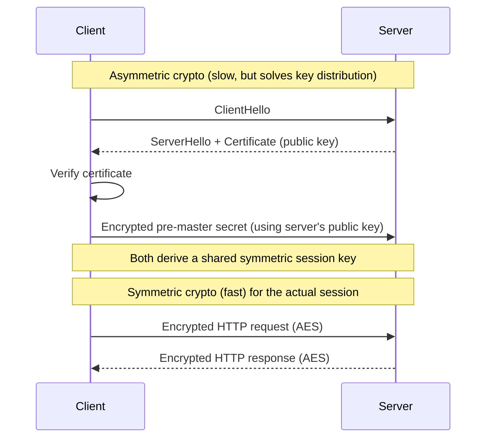
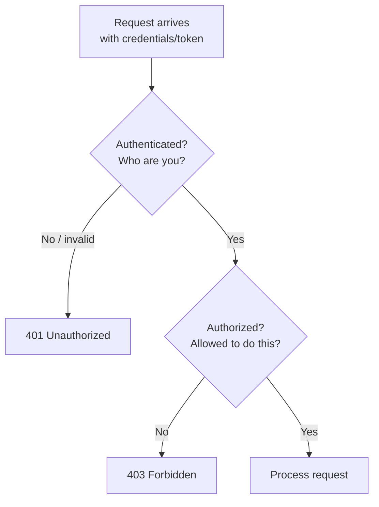
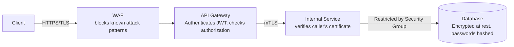

# Diagrams: Security Fundamentals

## ১. TLS: Asymmetric Handshake, তারপর Symmetric Session

*Asymmetric encryption শুধুমাত্র সংক্ষেপে ব্যবহার করা হয়, আগে থেকে একটি secret share করার প্রয়োজন ছাড়াই নিরাপদে একটি key-তে সম্মত হতে। একবার এটি সম্পন্ন হলে, দ্রুত symmetric algorithm (AES) বাকি সবকিছু encrypt করে।*

## ২. একটি Request-এ Authentication বনাম Authorization

*Authentication সবসময় প্রথমে ঘটে — আপনি যাকে identify করেননি তার জন্য permission চেক করতে পারবেন না। 401 মানে identity ব্যর্থ হয়েছে; 403 মানে identity সফল হয়েছে কিন্তু permission হয়নি।*

## ৩. একটি Request-এর পথ জুড়ে Defense in Depth

*প্রতিটি স্তর ধরে নেয় যে এর আগেরগুলো ব্যর্থ হতে পারে: WAF কিছু মিস করলেও TLS transit-এ data রক্ষা করে, TLS ইতিমধ্যে চললেও gateway এখনো authorization চেক করে, mTLS "trusted" internal network-এর ভেতরেও caller যাচাই করে, এবং একটি service compromised হলেও database এখনো network rule এবং encryption দ্বারা সুরক্ষিত থাকে।*
