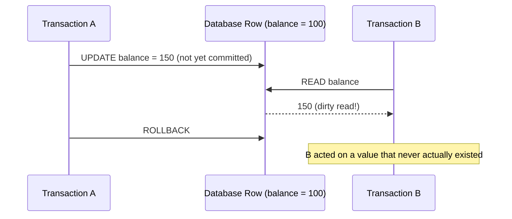
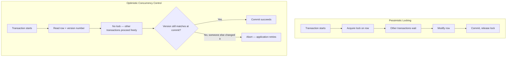
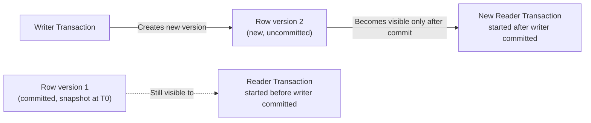

# Diagrams: Transaction Isolation Levels & Concurrency Control

## ১. একটি Dirty Read Anomaly

*Read Uncommitted-এর অধীনে, B এমন একটি value read করতে পারে যা A আসলে কখনো commit করেনি — যদি A rollback করে, তাহলে B ইতিমধ্যে এমন ডেটা ব্যবহার করে ফেলেছে যা আসলে কখনো ছিলই না।*

## ২. Pessimistic Locking vs. Optimistic Concurrency Control

*Pessimistic locking প্রতিদ্বন্দ্বীদের আগে থেকেই block করে দেয়; optimistic concurrency সবাইকে এগিয়ে যেতে দেয় এবং শুধু commit করার ঠিক আগে conflict চেক করে, একটি পাওয়া গেলে retry করে।*

## ৩. MVCC: Reader-রা একটি Consistent Snapshot দেখে, Writer-রা তাদের Block করে না

*writer commit করার আগে শুরু হওয়া একটি reader row-টির পুরোনো, consistent version দেখতে থাকে — এটি কখনো writer-এর জন্য অপেক্ষা করে block হয় না, এবং writer-ও কখনো এর জন্য অপেক্ষা করে block হয় না।*
