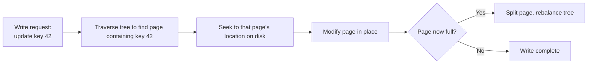
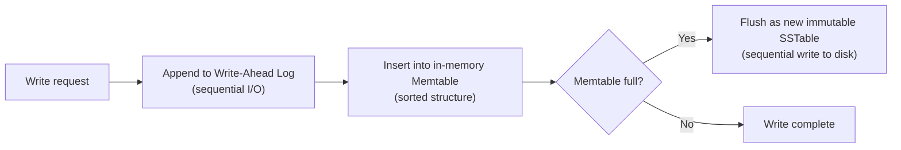
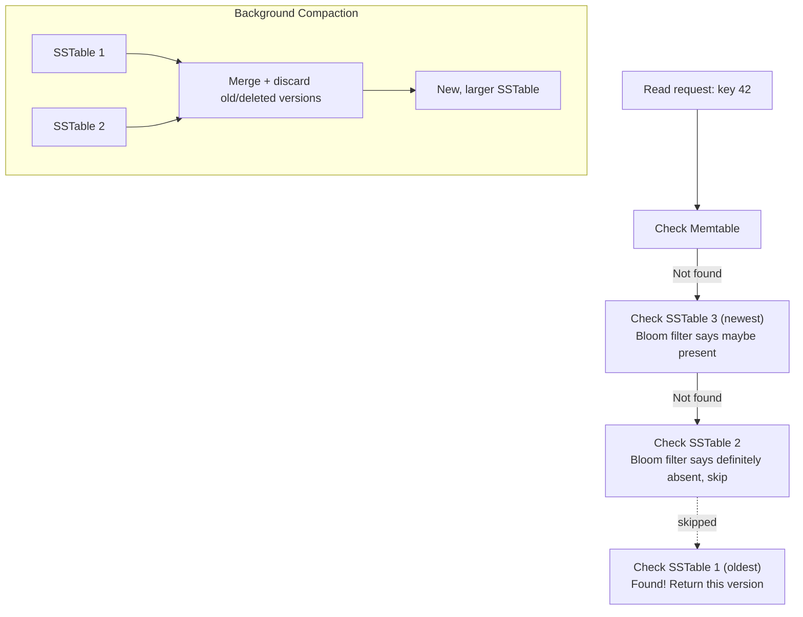

# Diagrams: LSM Trees vs. B-Trees

## ১. B-Tree Write Path: Seek করে In Place Modify করা

*প্রতিটি write-এর জন্য সেই key ধারণকারী নির্দিষ্ট page খুঁজে বের করতে হয়, তারপর সেটিকে in place modify করতে হয় — একটি random-access operation যা disk-এর যেকোনো জায়গায় ঘটতে পারে।*

## ২. LSM Tree Write Path: শুধু Append

*প্রতিটি write একটি sequential append — write-ahead log এবং in-memory memtable উভয়েই — disk-এর কোনো নির্দিষ্ট location-এ seek করার প্রয়োজন হয় না।*

## ৩. LSM Tree Read Path এবং Compaction

*একটি read প্রথমে memtable check করে, তারপর SSTable-গুলো newest থেকে oldest পর্যন্ত check করে, Bloom filter ব্যবহার করে সেসব SSTable বাদ দেয় যেগুলোতে প্রমাণিতভাবে সেই key নেই। Compaction background-এ চলে, SSTable-গুলোকে merge করে এবং stale/deleted data বাদ দিয়ে read amplification এবং space usage নিয়ন্ত্রণে রাখে।*
</content>
