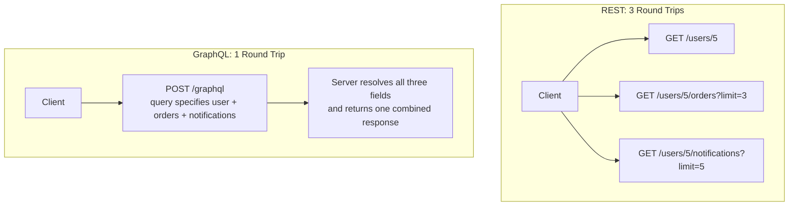
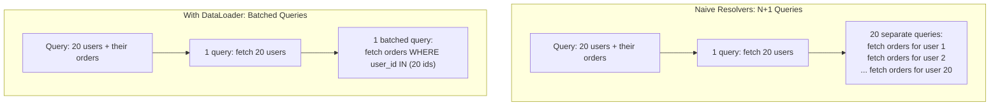
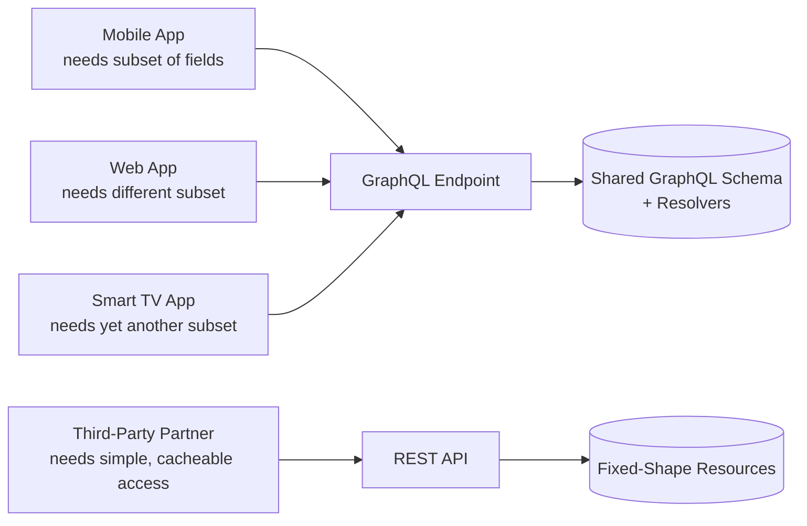

# Diagrams: GraphQL vs. REST

## ১. REST-এ Under-Fetching বনাম একটি GraphQL Query

*একটি screen-এর জন্য একাধিক resource থেকে data assemble করতে একাধিক REST round trip খরচ হয়, অথবা একটি GraphQL query যা পুরো combined shape আগে থেকেই নির্দিষ্ট করে দেয়।*

## ২. N+1 Query Problem এবং Batching

*Naive per-field resolvers একটি list-এর প্রতিটি item-এর জন্য একটি করে query trigger করতে পারে। Batching একই data type-এর জন্য সব requests একটি query execution-এর মধ্যে সংগ্রহ করে একটি single call-এ পরিণত করে।*

## ৩. প্রতিটি API Style কোথায় মানানসই

*ভিন্ন, evolving data প্রয়োজনসহ একাধিক client type কার্যকরভাবে একটি GraphQL schema share করে; সহজ, cacheable, well-documented access প্রয়োজন এমন একটি একক external partner-কে প্রায়ই এখনও REST দ্বারা ভালোভাবে সার্ভ করা হয়।*
