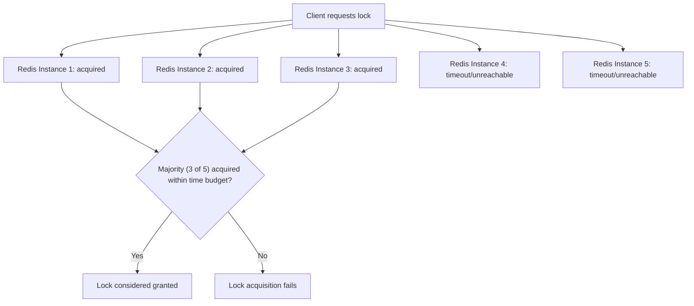
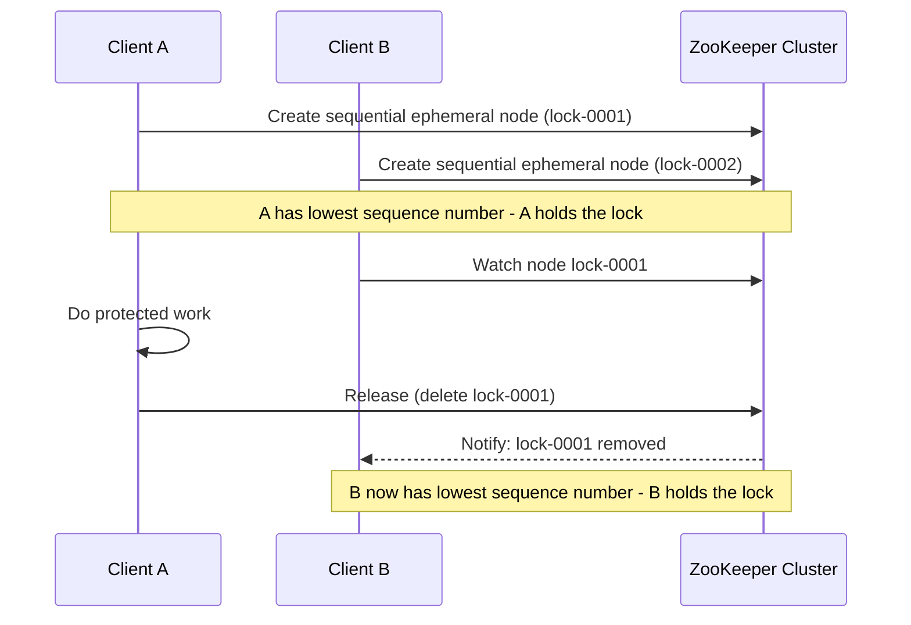
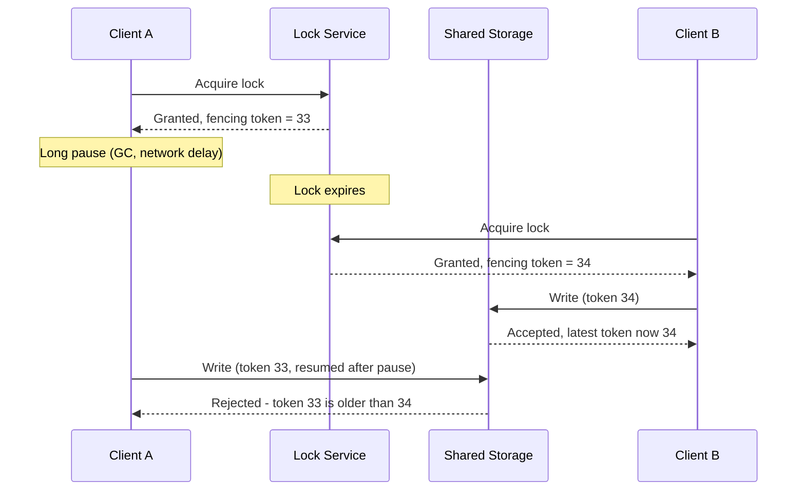

# Diagrams: Distributed Locking

## ১. Redlock: Independent Redis Instance জুড়ে Majority

*Redlock-এর কেবল independent instance-গুলোর একটি majority-র একমত হওয়া প্রয়োজন, তাই এটি কিছু instance ধীর বা unreachable হলেও সহ্য করতে পারে — বিনিময়ে এর safety সেই instance-গুলো জুড়ে timing assumption-এর ওপর নির্ভর করে।*

## ২. Sequential Ephemeral Node-এর মাধ্যমে ZooKeeper-Style Lock

*প্রতিটি প্রতিদ্বন্দ্বী একটি sequential node তৈরি করে; যার সংখ্যা সবচেয়ে কম সে lock ধরে রাখে, এবং সারিতে পরবর্তী জন এটি অদৃশ্য হওয়ার জন্য watch করে — হয় release-এ, অথবা সেই client-এর session মারা গেলে স্বয়ংক্রিয়ভাবে।*

## ৩. Fencing Token: একজন Stale Holder-কে ক্ষতি করা থেকে প্রতিরোধ করা

*যদিও Client A-এর lock check মূলত সফল হয়েছিল, এর stale fencing token প্রকৃতপক্ষে লেখার মুহূর্তে প্রত্যাখ্যাত হয় — resource নিজেই, শুধু lock নয়, correctness প্রয়োগ করে।*
