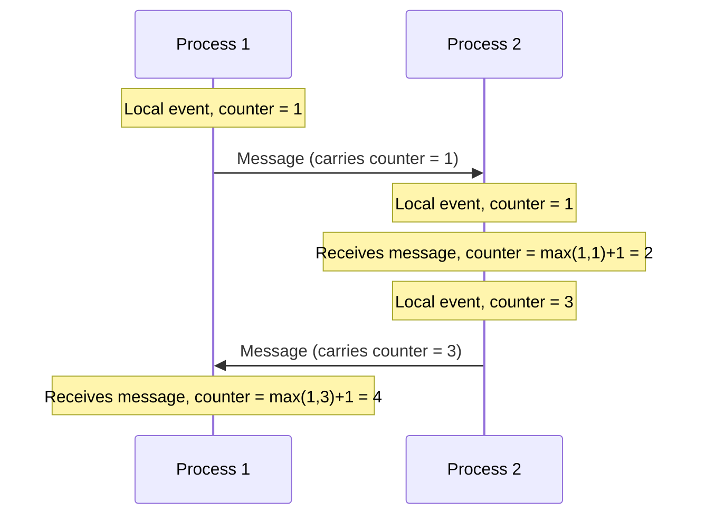
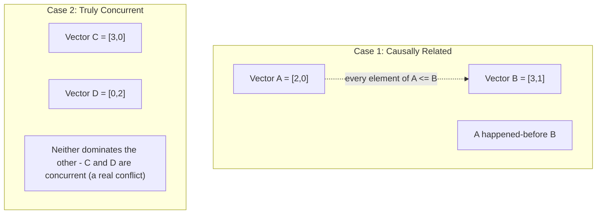
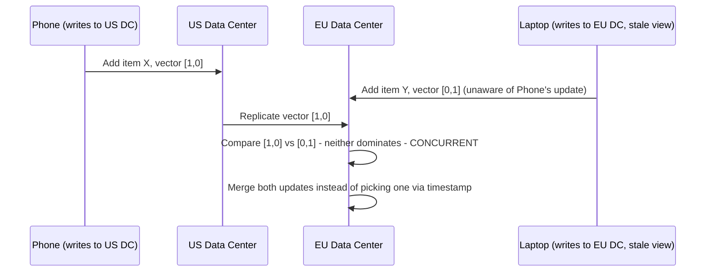

# Diagrams: Logical Clocks & Time in Distributed Systems

## ১. Lamport Timestamps: Happened-Before Ordering

*প্রতিটি local event একটি process-এর নিজস্ব counter বৃদ্ধি করে; একটি message পাওয়া counter-কে local এবং প্রাপ্ত উভয় মানের উপরে ঠেলে দেয় — নিশ্চিত করে যে causally-আগের যেকোনো event একটি ছোট সংখ্যা পাবে।*

## ২. Vector Clocks: প্রকৃত Concurrency শনাক্তকরণ

*যদি একটি vector প্রতিটি slot-এ অন্যটিকে dominate করে, events causally ordered। যদি কেউই dominate না করে, events স্বাধীনভাবে ঘটেছে — একটি প্রকৃত conflict, যা কোনো একক "কোনটি প্রথমে এলো" উত্তর দিয়ে সমাধান করা যায় না।*

## ৩. Vector Clocks একটি Shopping Cart Conflict সমাধান করছে

*যেহেতু কোনো write-এর vector clock অন্যটিকে dominate করে না, system সঠিকভাবে এটিকে একটি প্রকৃত conflict হিসেবে শনাক্ত করে এবং একটি অবিশ্বাস্য wall-clock timestamp-এর ভিত্তিতে একটিকে নীরবে বাতিল করার বদলে উভয় পরিবর্তন merge করে।*
</content>
