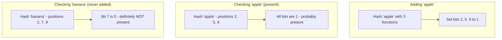
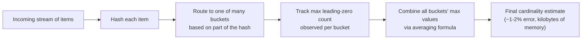
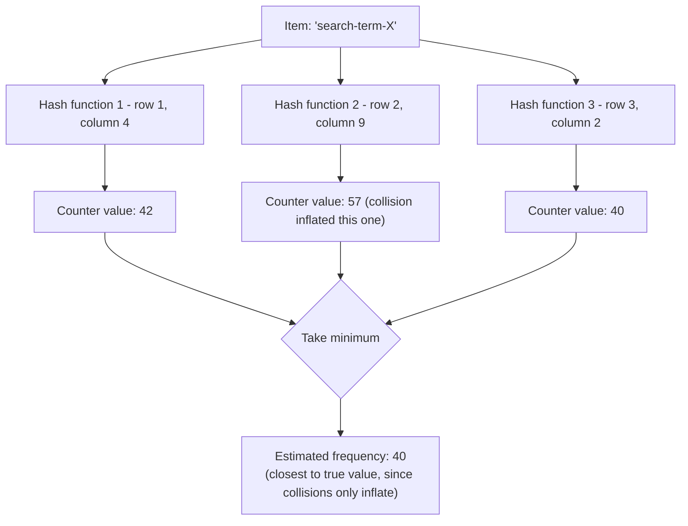

# ডায়াগ্রাম: Probabilistic Data Structures

## 1. Bloom Filter: Add এবং Check

*একটি এলিমেন্ট যোগ করা শুধুমাত্র bit সেট করে — membership যাচাই নির্ভর করে সংশ্লিষ্ট সব bit সেট আছে কিনা তার উপর। একটি শূন্য bit নিশ্চিতভাবে অনুপস্থিতি প্রমাণ করে; সব-এক শুধুমাত্র সম্ভাব্য উপস্থিতি প্রমাণ করে।*

## 2. HyperLogLog: Leading Zero থেকে Cardinality অনুমান

*পর্যবেক্ষণ করা hash value-এ leading zero-এর দীর্ঘতর run বেশি distinct আইটেম hash করার পরিসংখ্যানগত প্রমাণ — HyperLogLog সেই পরিসংখ্যানকে একটি compact cardinality অনুমানে রূপান্তরিত করে।*

## 3. Count-Min Sketch: Frequency অনুমান

*একই আইটেমের জন্য প্রতিটি hash function একটি ভিন্ন row-এর counter নির্দেশ করে; এদের সবার মধ্যে সর্বনিম্নটি নেওয়া অন্যান্য আইটেমের সাথে collision-এর কারণে সৃষ্ট স্ফীতি ফিল্টার করে দেয়, কারণ collision শুধুমাত্র একটি counter বাড়াতে পারে, কখনো কমাতে পারে না।*
