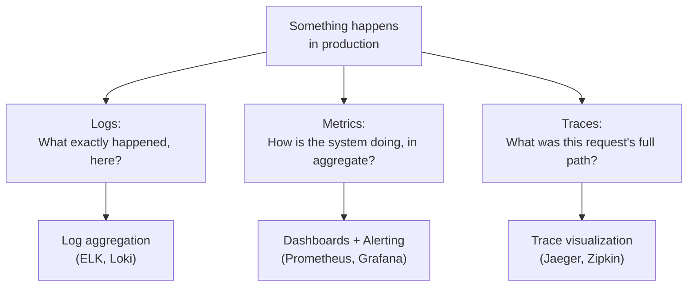
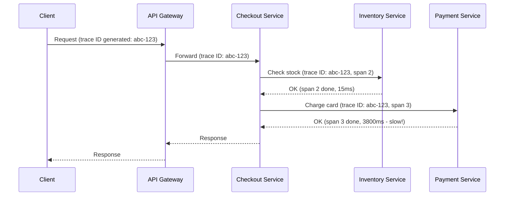
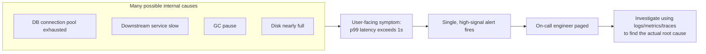

# ডায়াগ্রাম (Diagrams): Observability

## ১. তিনটি স্তম্ভ এবং প্রতিটি যা উত্তর দেয়

*প্রতিটি স্তম্ভ সিস্টেম আচরণের একটি ভিন্ন মাত্রা ক্যাপচার করে — এগুলোর কোনোটাই একা একটি distributed সিস্টেমের সম্পূর্ণ ছবি দেয় না।*

## ২. Microservices জুড়ে একটি Distributed Trace

*একই trace ID (abc-123) প্রতিটি service call-এর মধ্য দিয়ে প্রচারিত হয়, যা একটি tracing টুলকে সম্পূর্ণ পথ পুনর্গঠন করতে এবং সাথে সাথে দেখাতে দেয় যে Payment Service-এর span-ই request-এর latency-র প্রায় সবটুকুর জন্য দায়ী ছিল।*

## ৩. প্রতিটি অভ্যন্তরীণ কারণে নয়, Symptom-এর উপর Alerting

*User-facing symptom-এর উপর সরাসরি alert করা (প্রতিটি সম্ভাব্য অভ্যন্তরীণ কারণের উপর নয়) signal-to-noise অনুপাত উচ্চ রাখে — প্রকৃত root cause পরে খুঁজে বের করা হয়, তদন্তের সময়, বাকি observability স্তম্ভগুলো ব্যবহার করে।*
