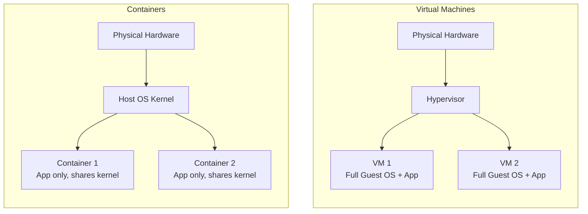
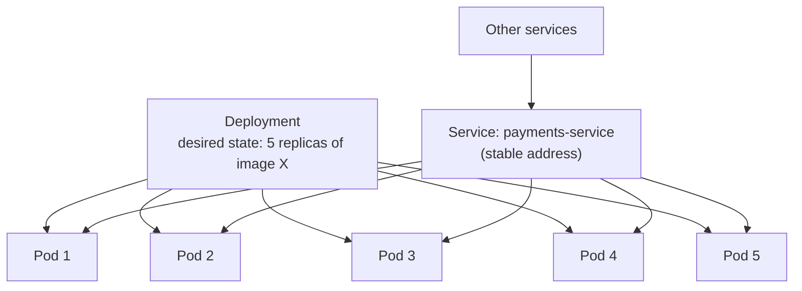
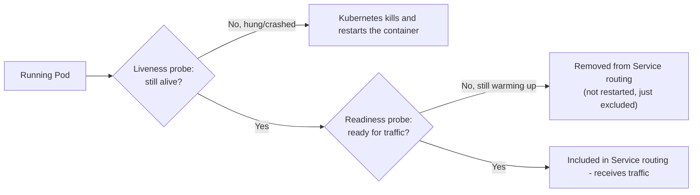

# ডায়াগ্রাম: Containers & Orchestration

## ১. Virtual Machines বনাম Containers

*প্রতিটি VM তার নিজস্ব পূর্ণাঙ্গ OS kernel বহন করে, যা উল্লেখযোগ্য overhead যোগ করে। Container-গুলো host-এর kernel share করে এবং শুধুমাত্র application layer isolate করে, যা এগুলোকে অনেক বেশি হালকা এবং দ্রুত শুরু হওয়ার উপযোগী করে তোলে।*

## ২. Kubernetes-এর মূল Object একসাথে কাজ করছে

*একটি Deployment কাঙ্ক্ষিত সংখ্যক Pod চলমান রাখে; একটি Service caller-দের একটি স্থিতিশীল ঠিকানা দেয় যা বর্তমানে যে Pod-গুলো healthy তাদের দিকে route করে, যেকোনো মুহূর্তে কোন নির্দিষ্ট Pod বিদ্যমান তা নির্বিশেষে।*

## ৩. Liveness বনাম Readiness Probe

*একটি ব্যর্থ liveness probe একটি restart trigger করে; একটি ব্যর্থ readiness probe শুধু pod-টিকে ট্রাফিক গ্রহণ থেকে বাদ দেয় যতক্ষণ না এটি সুস্থ হয়, একে kill না করেই — দুটি ভিন্ন সমস্যা, দুটি ভিন্ন সাড়া।*
</content>
