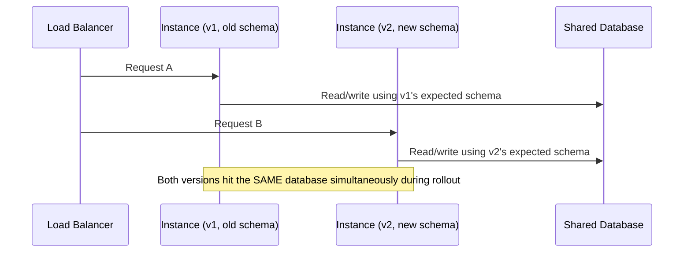
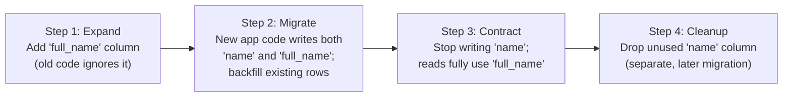

# Diagrams: Zero-Downtime Deployments & Database Migrations

## ১. Rolling বনাম Blue-Green বনাম Canary

```mermaid
flowchart TB
    subgraph Rolling["Rolling Deployment"]
        R1["v1, v1, v1, v1, v1"] --> R2["v2, v1, v1, v1, v1"]
        R2 --> R3["v2, v2, v1, v1, v1"]
        R3 --> R4["v2, v2, v2, v2, v2"]
    end

    subgraph BlueGreen["Blue-Green Deployment"]
        B1["Blue (v1): 100% traffic<br/>Green (v2): 0% traffic, deploying"] --> B2["Blue (v1): 100% traffic<br/>Green (v2): fully deployed, health-checked"]
        B2 --> B3["Router switches:<br/>Green (v2): 100% traffic<br/>Blue (v1): idle, ready for rollback"]
    end

    subgraph Canary["Canary Deployment"]
        C1["v2: 5% traffic<br/>v1: 95% traffic"] --> C2["v2: 25% traffic<br/>v1: 75% traffic<br/>(metrics look healthy)"]
        C2 --> C3["v2: 100% traffic<br/>v1: 0% traffic"]
    end
```

*Rolling মোটামুটি স্থির capacity বজায় রেখে ধীরে ধীরে instance replace করে; blue-green দুটো সম্পূর্ণ environment-এর মধ্যে atomically cut over করে; canary সমস্যা আছে কিনা দেখতে দেখতে ধীরে ধীরে নতুন-version traffic বাড়ায়।*

## ২. কেন Rollout-এর মাঝখানেও পুরনো ও নতুন Version-কে Compatible থাকতে হয়

*যেকোনো rolling বা canary rollout-এর সময়, পুরনো ও নতুন উভয় instance-ই একই সাথে একই shared database query করে — একটা schema পরিবর্তনকে দুই version-এর জন্যই সঠিকভাবে কাজ করতে হবে, নয়তো তাদের একটা deploy-এর মাঝখানেই ব্যর্থ হতে শুরু করবে।*

## ৩. একটা Database Migration-এর জন্য Expand-Contract Pattern

*একসাথে চলমান পুরনো ও নতুন application instance-এর যেকোনো মিশ্রণের জন্যই প্রতিটি ধাপ আলাদাভাবে নিরাপদ — ঝুঁকিপূর্ণ কাজটা হলো এক deploy-এ Step 1 থেকে সরাসরি Step 4-এ চলে যাওয়া।*
