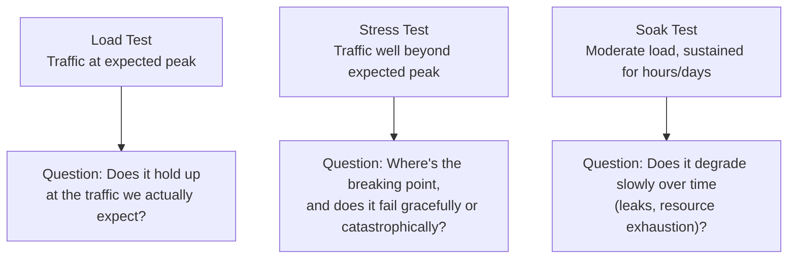
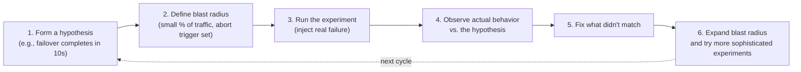
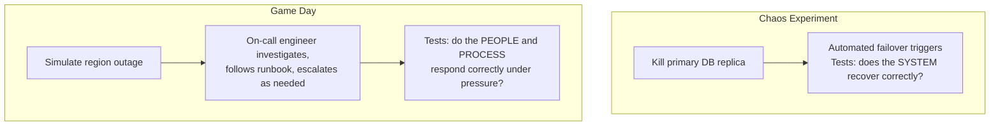

# Diagrams: Testing Distributed Systems

## ১. তিন ধরনের Load Testing

*প্রতিটা testing type সিস্টেম traffic-এর অধীনে—প্রত্যাশিত, extreme, বা sustained—কীভাবে আচরণ করে তা নিয়ে একটা আলাদা প্রশ্নের উত্তর দেয়।*

## ২. Chaos Engineering Loop

*Chaos engineering একটা disciplined, repeatable loop—random ধ্বংস নয়—যা প্রায় সবসময়ই ডিজাইন করা আচরণ ও প্রকৃত আচরণের মধ্যে একটা ফাঁক সামনে আনে, যা ঠিক এর মূল্য।*

## ৩. Chaos Experiment বনাম Game Day: প্রতিটা আসলে কী টেস্ট করে

*একটা chaos experiment টেস্ট করে automated system ডিজাইন অনুযায়ী recover করে কিনা। একটা game day আরও এগিয়ে গিয়ে টেস্ট করে এর চারপাশের মানুষ এবং documented procedure কিছু ভেঙে গেলে আসলেই কাজ করে কিনা।*
