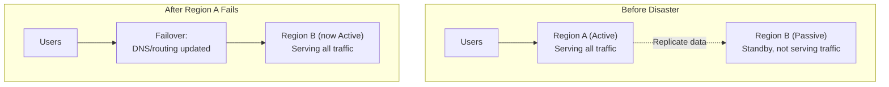
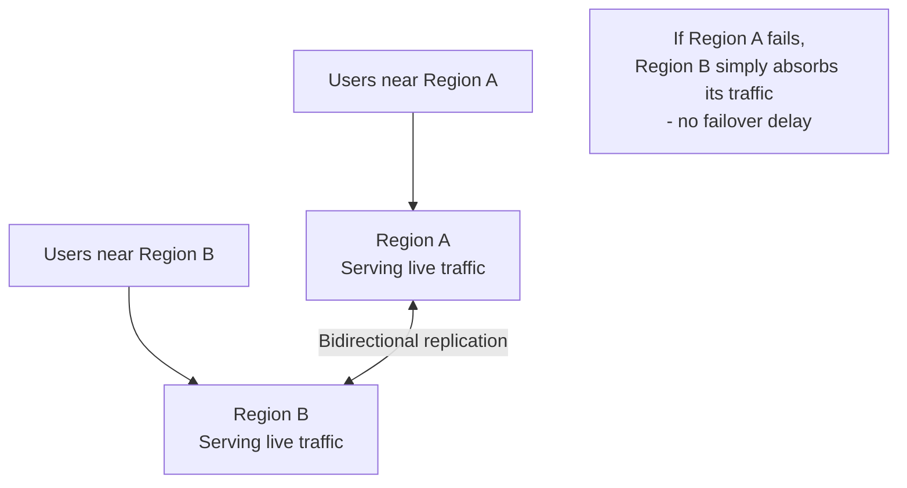
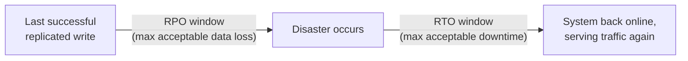

# Diagrams: Multi-Region Architecture & Disaster Recovery

## ১. Active-Passive Failover

*স্বাভাবিক অবস্থায়, Region B replicated data নিয়ে অলস অবস্থায় থাকে। একটি failure-এর পর, traffic তার দিকে redirect করা হয় — কিন্তু সেই redirection নিজেই সময় নেয়, যার জন্য RTO একটি গ্রহণযোগ্য সীমা নির্ধারণ করে।*

## ২. Active-Active: প্রতিটি Region Traffic পরিবেশন করে

*উভয় region একই সাথে traffic পরিবেশন করে, নৈকট্য অনুযায়ী route করা হয় — একটি fail করলে, "take over" করার জন্য কোনো একক point নেই, কিন্তু উভয় জায়গায় গৃহীত write অবশ্যই মিলিয়ে নিতে (reconcile) হবে।*

## ৩. একটি Timeline-এ RTO এবং RPO

*RPO disaster থেকে পেছনের দিকে পরিমাপ করে — কতটা সাম্প্রতিক data হারানো যেতে পারত। RTO disaster থেকে সামনের দিকে পরিমাপ করে — service পুনরুদ্ধার হতে কতক্ষণ লাগে। দুটোই ব্যবসা-নির্ধারিত লক্ষ্য যা প্রকৃত architecture পছন্দ চালিত করে।*
