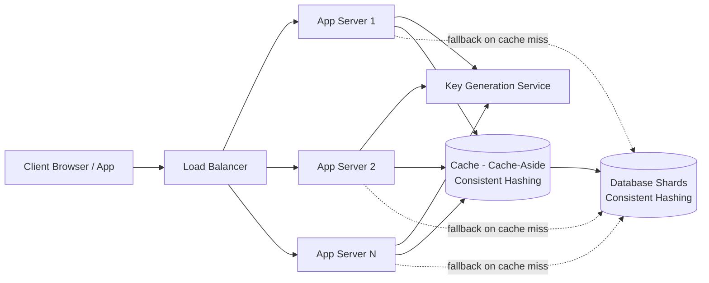
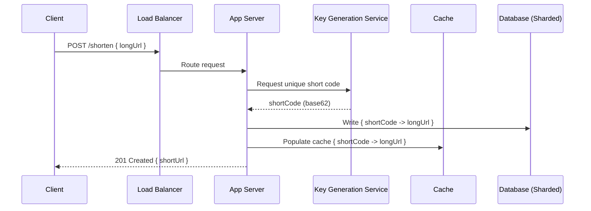
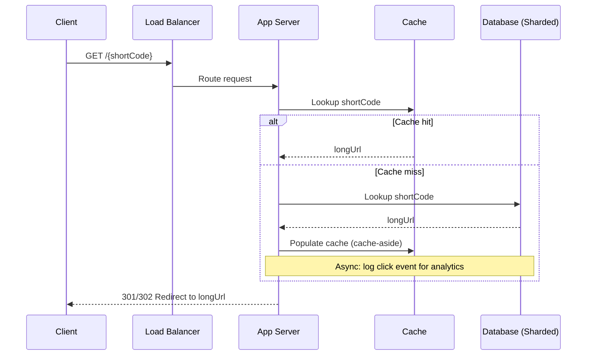

# ডায়াগ্রাম: URL Shortener

## ১. High-Level Architecture

*Caption: Client request একটি load balancer-এ hit করে, stateless app server জুড়ে fan out হয়, যেগুলো write-এ একটি key generation service-এর এবং read-এ sharded database-এর সামনে একটি cache-aside layer-এর সাথে পরামর্শ করে।*

## ২. Write Path (একটি URL Shorten করা)

*Caption: Write-এ, app server key generation service থেকে একটি collision-free short code পায়, sharded database-এ mapping persist করে, এবং response দেওয়ার আগে cache warm করে।*

## ৩. Read Path (Redirect)

*Caption: Read path প্রথমে near-instant redirect-এর জন্য cache-aside layer check করে, শুধুমাত্র cache miss হলে sharded database-এ fall back করে, এবং click logging-কে critical path থেকে দূরে রাখে।*
