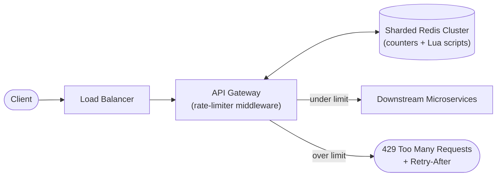
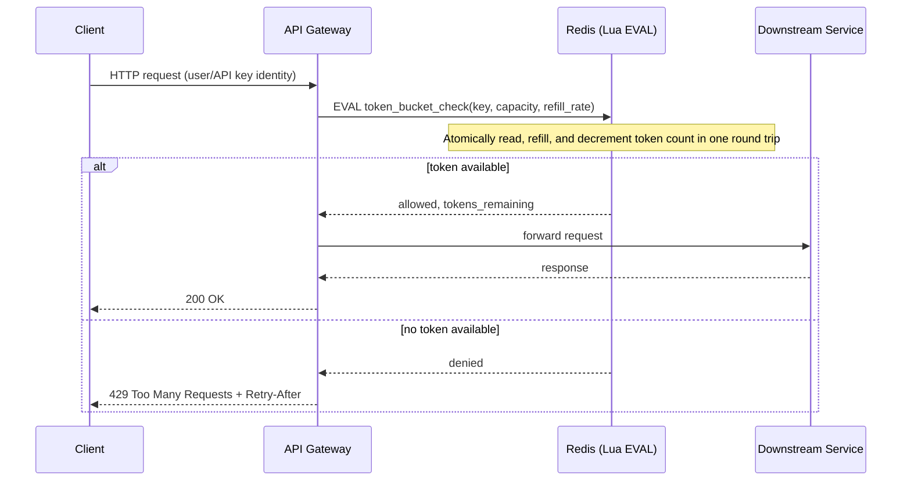
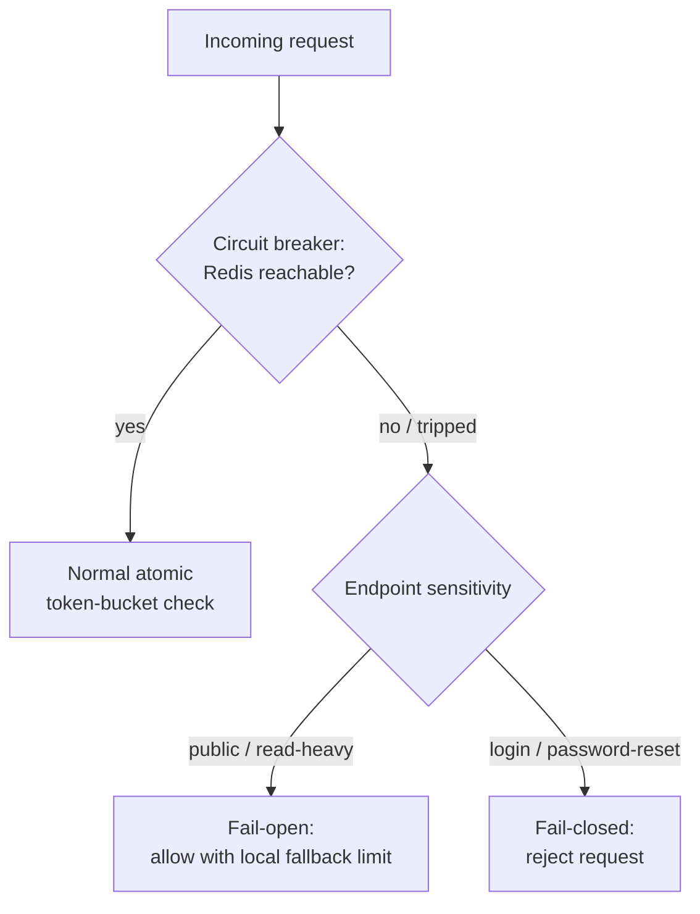

# Diagrams — Design a Rate Limiter

[`README.md`](./README.md)-এর সহায়ক diagram। Terminology `notes.md`-এর সাথে মিলে যায়।

## ১. High-Level Architecture

*Caption: Request গুলো API gateway-তে একটি কেন্দ্রীভূত, sharded Redis store-এর বিরুদ্ধে check করা হয়; reject করা request গুলো edge-এ short-circuit হয় এবং কখনো downstream service-এ পৌঁছায় না।*

## ২. Request-Check Sequence (Redis Lua Script-এর মাধ্যমে Token Bucket)

*Caption: check-and-decrement একটি একক atomic Lua script হিসেবে Redis-এ ঘটে, যা অনেক concurrent gateway instance জুড়ে check-then-increment race condition দূর করে।*

## ৩. Failure Mode — Redis Unavailable থাকলে Fail-Open বনাম Fail-Closed

*Caption: যখন rate-limiter store নিজেই বন্ধ থাকে, একটি circuit breaker প্রতিটি endpoint-এর sensitivity অনুযায়ী নির্বাচিত একটি স্পষ্ট fail-open বা fail-closed policy-তে route করে।*
