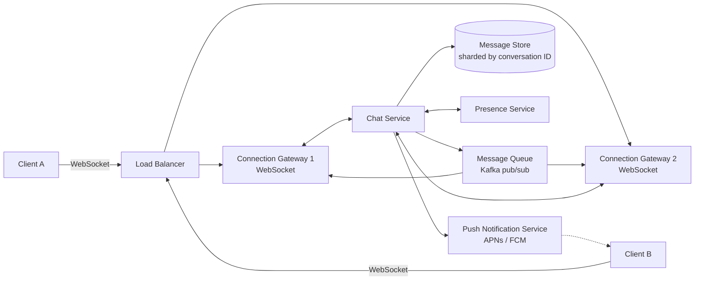
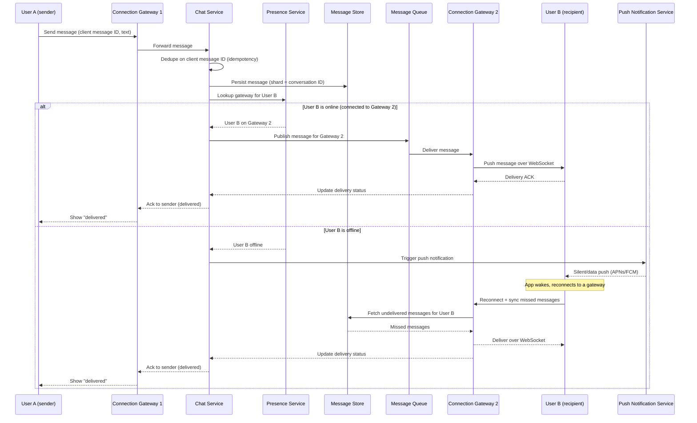

# Diagrams — একটি Chat Application ডিজাইন করা (WhatsApp-এর মতো)

## ১. সামগ্রিক Architecture

*Clients একটি নির্দিষ্ট Connection Gateway-তে pinned persistent WebSocket connections ধরে রাখে; Chat Service messages sharded storage-এ persist করে এবং প্রতিটি message recipient-এর gateway-তে route করার জন্য, অথবা recipient offline থাকলে Push Notification Service-এ route করার জন্য Message Queue এবং Presence Service ব্যবহার করে।*

## ২. ভিন্ন Connection Servers-এ থাকা দুই ব্যবহারকারীর মধ্যে Message Delivery

*Gateway 1-এ থাকা User A-র একটি message persist করা হয় এবং Message Queue-এর মাধ্যমে User B-র Gateway 2-তে route করা হয় যদি সে online থাকে, অথবা User B offline থাকলে একটি push notification এবং Message Store থেকে একটি reconnect-and-sync pull trigger করে।*
