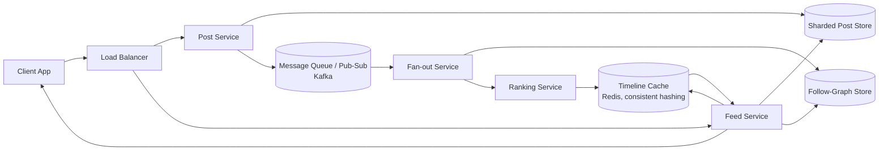
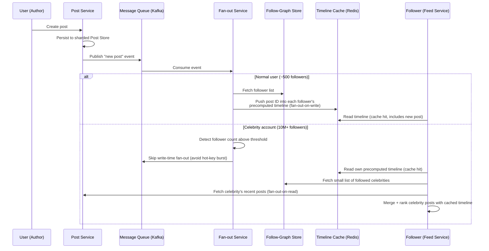

# ডায়াগ্রাম: একটি নিউজ ফিড সিস্টেম ডিজাইন করা (Twitter/Facebook)

## ১. সামগ্রিক Architecture

*Caption: Writes প্রবাহিত হয় Post Service থেকে একটি sharded post store এবং একটি Kafka-ভিত্তিক pub-sub layer দিয়ে Fan-out ও Ranking service-এ, যা একটি consistently-hashed Redis timeline cache পূরণ করে; reads প্রধানত সেই cache থেকে Feed Service দ্বারা সার্ভ করা হয়।*

## ২. Hybrid Fan-out Sequence: Celebrity Post বনাম Normal Post

*Caption: সাধারণ ব্যবহারকারীর post write সময়েই followers-এর cache-এ push করা হয়, অন্যদিকে celebrity post ব্যয়বহুল push এড়িয়ে গিয়ে read সময়ে প্রতিটি follower-এর feed-এ merge করা হয়, যা একটি hot-key write burst এড়িয়ে চলে।*
